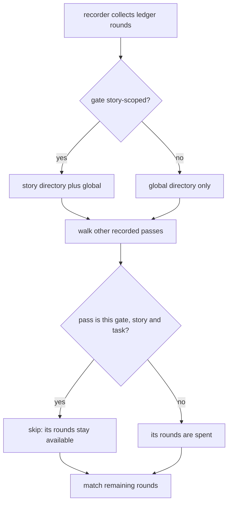

# GATES-1-T1 — A question round belongs to its gate and story

## Context

Decision 0067 (accepted, superseding 0051) says a question round belongs to the
gate and story it was asked for and may be reused when re-recording THAT gate for
THAT story, never across a different gate, story or task.

The recorder does not behave that way. `record_grill_from_json.py:70-100` walks
every recorded pass it can find, treats all of their rounds as spent, and matches
a ledger round by question, options and answer alone. The one exception is narrow
to the point of uselessness: a pass skips its own record only while its rounds are
byte-identical to the ones already stored. Change a single round and the pass
starts consuming its own history, so re-recording a gate after resolving findings
demands a brand new question. On one client task that produced roughly fifteen
owner questions, several of which existed only to satisfy the recorder.

Separately, ledger rounds are collected from the active story's directory AND the
global one for every gate, so a globally recorded gate can consume a round asked
during an entirely different story. 0051 permitted that by accident.

## What changes

1. **Provenance is location, and it is already recorded.** Three earlier drafts
   of this contract invented a carrier: a session context written by the grill,
   read by the hook, stamped onto the round. None of it is needed. The hook
   already writes a round into the ACTIVE STORY's `grill-rounds/` directory, and
   a recorded pass already lands at a path unique per gate, story and task, since
   `Gate.evidence_name` returns `grills/tasks/<id>.json` for a task gate and
   `grills/<gate>.json` otherwise, under the story directory when the gate is
   story-scoped. Both halves of the rule can be read off those two facts.

2. **A pass stops spending its own rounds.** The self-exclusion in the used-rounds
   walk drops its equality condition: a pass never treats the rounds of its own
   evidence path as spent, whatever they now contain. Because that path is unique
   per gate, story and task, this is exactly "reusable at THAT gate for THAT
   story" and nothing wider. Every other pass keeps consuming, which is what still
   refuses a round at a different gate, story or task.

3. **Global gates are untouched.** An earlier draft of this contract narrowed
   ledger collection for non-story-scoped gates to the global directory, to close
   what 0067 called 0051's hole. There is no hole: the recorder only ever reads
   the ACTIVE story's rounds plus the global ones, so another story's rounds were
   never reachable. The narrowing broke the ordinary flow instead — spec, signoff
   and epics are recorded while a story IS active, so their rounds live in that
   story's directory, and two existing gate tests failed. Decision 0067 is
   amended to say so. This task changes ONE condition.

4. **Nothing else moves.** No session context, no ceremony-target routing, no
   hook change, no schema field, no legacy class and no migration, because no
   round changes at all. The earlier drafts' failure modes — a context outliving
   its reader, writer and reader resolving different directories, a legacy round
   colliding with a scoped one — cannot occur in a design that stores nothing.

5. **The suite is green, so nothing special is needed to close the stage.** An
   earlier draft of this contract carried a baseline comparator and committed
   baseline data, because the plan said the suite was 93 red. It is not. The
   93 came from a non-hermetic board probe — `already_serving` answered "is ANY
   board up" rather than "is a board for THIS repo up", and `task approve`
   starts one — and sharding under CPU contention inflated it to 99. Measured
   sequentially and alone, `factory/tests` is 942 passed, 0 failed. The
   comparator and its baseline file are CUT: a plain full-suite verify closes
   this stage. The probe is fixed separately, not here.

6. **Decision 0055 is not this task's to own, and this task does not pretend
   otherwise.** An earlier draft named 0055's lint, format and type checks as T1's
   verify commands while also saying 0055 was out of scope — a contradiction that
   only surfaced when the seal ran them. They cannot pass: `ruff format --check`
   reformats 97 files because the repo has never been ruff-formatted, the three
   `ruff check` errors in the recorder are identical on `origin/main`, and the
   twelve in the new suite are all F811 against pytest's `repo` fixture, which is
   idiomatic and simply unconfigured here. Wiring 0055 means configuring ruff and
   pyright and threading them through `verify.py` and CI — real work, belonging to
   the T3 task that already changes the verify path. T1 verifies with the full
   suite and `./forge doctor`, both of which pass.

7. **The floor is untouched.** Every gate still requires at least one real round,
   and a pass still cannot be recorded against a question nobody asked.

## Non-goals

The manifest, the freshness predicate, the ledger terminal states and the task
snapshot are T3, T2 and T4. No gate changes what it judges.

## Workflow

## Manual Verification

1. Record a gate pass, resolve a finding, and re-record the SAME gate with an
   edited round set: it succeeds with no new question.
2. Try to record a DIFFERENT gate against that same round: it is refused.
3. Answer a question while a story is active, then record a global gate against
   it: it succeeds, exactly as before.
4. Record a task gate for task A, then try the same round for task B: refused.
5. Record a global gate with no story active: it behaves exactly as it does today.

## Verify

`uv run --with pytest --with psutil python -m pytest factory/tests -q`, which is
green, and `./forge doctor`. Decision 0055's static checks are NOT run here: see
item 6 — they are unconfigured repo-wide and wiring them is T3's.

<!-- forge:contract -->
## Contract (recorded)

Rendered by the harness from the recorded decomposition; edit the decomposition, not this block. It is excluded from the plan's approval and grill digests, so a re-render never stales either.

**Objective.** A pass stops treating its own recorded rounds as spent, so re-recording the same gate for the same story and task reuses them and needs no invented question, while every other pass still spends them so a round never crosses to a different gate, story or task. That is the whole change: one condition in the consumption walk. Provenance is read from where evidence already lives, so no round, schema, hook or global-gate behaviour changes. Implements decision 0067.

**Acceptance criteria**

- Re-recording the same gate for the same story and task consumes its own existing round and requires no new question, including when the submitted round set differs from the one already stored
- A round already consumed by a pass at a different gate is refused
- A round already consumed by a pass for a different story is refused
- A round already consumed by a pass for a different task id is refused
- A gate that is not story-scoped is unchanged: it still reads the active story's rounds as well as the global ones
- A story-scoped gate still consumes rounds asked before any story existed
- The floor of at least one real round per gate still holds, asserted both ways
- No round record, schema or hook changes, asserted by the existing ledger round shape test still passing untouched

**Write scope** (what `stage done` measures the diff against)

- factory/scripts/record_grill_from_json.py
- factory/tests/test_round_provenance.py

**Required tests** (run by `stage done`)

- `test_re_recording_the_same_gate_reuses_its_round_after_an_edit` -- `uvx --with pytest python3 -m pytest {path}::{id} -q -o junit_family=legacy --junitxml={report}` (factory/tests/test_round_provenance.py)
- `test_a_round_is_refused_at_a_different_gate` -- `uvx --with pytest python3 -m pytest {path}::{id} -q -o junit_family=legacy --junitxml={report}` (factory/tests/test_round_provenance.py)
- `test_a_round_is_refused_for_a_different_story` -- `uvx --with pytest python3 -m pytest {path}::{id} -q -o junit_family=legacy --junitxml={report}` (factory/tests/test_round_provenance.py)
- `test_a_round_is_refused_for_a_different_task_id` -- `uvx --with pytest python3 -m pytest {path}::{id} -q -o junit_family=legacy --junitxml={report}` (factory/tests/test_round_provenance.py)
- `test_a_global_gate_is_unchanged_when_no_story_is_active` -- `uvx --with pytest python3 -m pytest {path}::{id} -q -o junit_family=legacy --junitxml={report}` (factory/tests/test_round_provenance.py)
- `test_a_story_gate_still_consumes_a_pre_story_round` -- `uvx --with pytest python3 -m pytest {path}::{id} -q -o junit_family=legacy --junitxml={report}` (factory/tests/test_round_provenance.py)
- `test_the_floor_of_one_real_round_per_gate_still_holds` -- `uvx --with pytest python3 -m pytest {path}::{id} -q -o junit_family=legacy --junitxml={report}` (factory/tests/test_round_provenance.py)

**Verify commands**

- `uv run --with pytest --with psutil python -m pytest factory/tests -q`
- `./forge doctor`

**Review budget.** 2 files / 200 lines -- One condition in the recorder's consumption walk and one new suite. Two earlier drafts were cut by evidence: the baseline comparator (the 93-red premise was an artefact) and the global-gate narrowing (0051's hole does not exist, and narrowing broke spec/signoff/epics, which two gate tests caught).
<!-- /forge:contract -->
