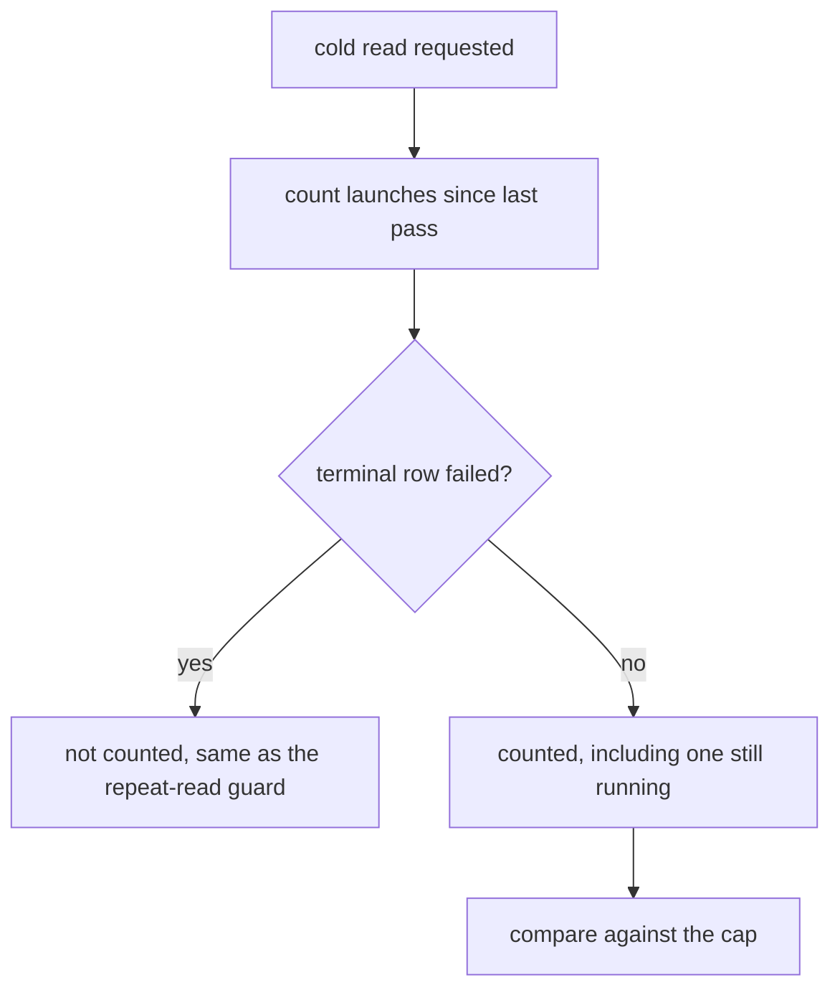

# GATES-1-T2 — The cap and the repeat-read guard agree

## Context

Two guards read the same ledger and disagree about what a read is.

Neither guard collapses a launch to its outcome, so neither can exclude a failed
one.

Every launch appends three rows: `starting`, then `running`, then a terminal row.
Confirmed against the live ledger — all twelve grill launches recorded there are
`('starting', 'running', 'succeeded')`.

`_rounds_since_last_pass` (`forge_cli/grill.py:293`) counts DISTINCT `launch_id`s
from raw rows with no status filter at all, so a launch that died still spends an
allowance from a budget whose purpose is to stop a reader circling. Nothing
circled.

`_refuse_a_second_cold_read` (`forge_cli/grill.py:386`) looks like it handles
this — it drops rows whose `launch_status` is `failed`. It does not: a failed
launch's `starting` and `running` rows are not `failed`, they still carry its id,
and the guard still refuses. An earlier draft of this contract took that filter
at face value and proposed copying it to the cap, which would have fixed
nothing.

## What changes

1. **One collapsed view of the ledger, used by both guards.** Rows are grouped by
   `launch_id` and reduced to the latest row for that launch. A launch is failed
   when THAT row is `failed` — not when some row is. Both `_rounds_since_last_pass`
   and `_refuse_a_second_cold_read` consume the same view, so they stop
   disagreeing about what a read is.

2. **A failed launch spends nothing and blocks nothing.** It neither counts
   toward the cap nor makes the repeat-read guard refuse.

3. **A launch still in flight still counts.** A launch whose latest row is
   `starting` or `running` is a read in progress and spends its allowance as it
   does today. The change is strictly about launches that ended badly.

4. **Nothing new is recorded.** `launch_status` already carries `failed`, written
   by the non-zero-exit branch, by stale-launch recovery and by the exception
   branches. The data was always there; both readers were reading it wrongly.

## Non-goals

**No `answered` / `interrupted` outcome field.** An earlier draft of this
contract added one, keyed on the griller's `CONVERGED` / `NOT CONVERGED` marker.
It cannot work as written: `delegate.py:1159` runs the companion with `--json`,
so stdout is a serialized object whose verdict text lives in `rawOutput` and
whose raw ending is `}`. Matching the marker against stdout would mark every
valid read `interrupted`, and substring matching would count progress chatter as
a verdict. Detecting a genuinely silent read needs payload decoding, an
end-anchored grammar over `rawOutput`, failure precedence for the host-side
branches that write `failed` after a zero exit, and an outcome config persisted on
the starting row so read-launch recovery can use it — recovery runs only for
`write=True` rows and grills are read-only, so it cannot see an in-memory
argument.

That is deferred as **D-0032**, with a revisit trigger, not dropped. The upstream
compaction fault that motivated it is fixed in codex 0.154.0, so there is
currently no observed case of a read exiting zero without a verdict.

**The escalation grant is T5**, split out on the previous read: scoping it to a
gate and task needs `signal.py`, `forge.py` and the schema, because
`open_escalation` returns the first unspent record globally and the record carries
no gate.

The manifest and freshness predicate are T3; post-stage task freshness is T4.

## Workflow

## Manual Verification

1. Let a grill read finish, then start another: the count reports one round used.
2. Kill a launcher mid-read so its lifecycle ends `starting, running, failed`,
   then read again: the count is unchanged AND the repeat-read guard does not
   refuse — today both do the opposite.
3. Reach the cap with real reads: it still refuses, so the budget is not disabled.

## Verify

`uv run --with pytest --with psutil python -m pytest factory/tests -q`, run and
green before being written here.

`./forge doctor` is deliberately NOT a verify command: it compares locally
installed skills against an external repository's HEAD, went stale twice
yesterday hours apart, and blocked T1's seal on a machine-readiness fact
unrelated to whether this code is correct.

<!-- forge:contract -->
## Contract (recorded)

Rendered by the harness from the recorded decomposition; edit the decomposition, not this block. It is excluded from the plan's approval and grill digests, so a re-render never stales either.

**Objective.** Every launch appends starting, running, then a terminal row, and neither grill guard collapses them — so filtering rows by status cannot exclude a failed launch, whose starting and running rows still carry its id. The cap counts every launch regardless, and the repeat-read guard's existing failed-filter does not work. Both adopt one view that collapses rows by launch_id to the latest, so a launch whose latest row is failed spends no allowance and blocks no further read. No new ledger field.

**Acceptance criteria**

- Rows are collapsed by launch_id to the latest row, and both guards consume that same view
- A launch whose lifecycle ends starting, running, failed does not count toward the cap
- That same failed launch does not make the repeat-read guard refuse, which it does today
- A launch whose lifecycle ends starting, running, succeeded still counts, so the budget is not disabled
- A launch whose latest row is starting or running counts as a read in flight
- No new field is written to the delegation ledger, and launch_status keeps its existing values

**Write scope** (what `stage done` measures the diff against)

- factory/scripts/forge_cli/grill.py
- factory/tests/test_grill_budget.py

**Required tests** (run by `stage done`)

- `test_a_failed_lifecycle_does_not_count_toward_the_cap` -- `uv run --with pytest --with psutil python -m pytest {path}::{id} -q -o junit_family=legacy --junitxml={report}` (factory/tests/test_grill_budget.py)
- `test_a_failed_lifecycle_does_not_block_the_repeat_read_guard` -- `uv run --with pytest --with psutil python -m pytest {path}::{id} -q -o junit_family=legacy --junitxml={report}` (factory/tests/test_grill_budget.py)
- `test_a_succeeded_lifecycle_still_counts` -- `uv run --with pytest --with psutil python -m pytest {path}::{id} -q -o junit_family=legacy --junitxml={report}` (factory/tests/test_grill_budget.py)
- `test_a_launch_still_in_flight_counts` -- `uv run --with pytest --with psutil python -m pytest {path}::{id} -q -o junit_family=legacy --junitxml={report}` (factory/tests/test_grill_budget.py)
- `test_both_guards_agree_on_the_same_collapsed_view` -- `uv run --with pytest --with psutil python -m pytest {path}::{id} -q -o junit_family=legacy --junitxml={report}` (factory/tests/test_grill_budget.py)
- `test_no_new_ledger_field_is_written` -- `uv run --with pytest --with psutil python -m pytest {path}::{id} -q -o junit_family=legacy --junitxml={report}` (factory/tests/test_grill_budget.py)

**Verify commands**

- `uv run --with pytest --with psutil python -m pytest factory/tests -q`

**Review budget.** 2 files / 200 lines -- One collapsed terminal-launch view in grill.py consumed by both guards, and one new suite seeding real row lifecycles. Two earlier drafts were cut by their own cold reads: the outcome field (the companion emits JSON, D-0032) and the escalation grant (scoping does not exist, split to T5).
<!-- /forge:contract -->
