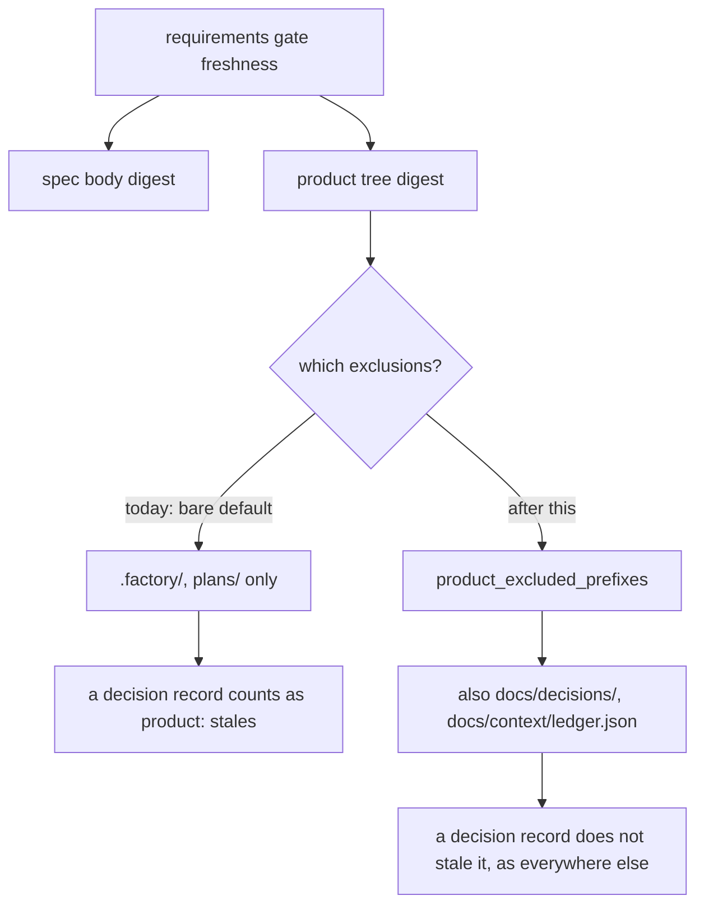

# GATES-1-T3 — The requirements gate joins the one definition of product

## Context

One list never joined the list that was created to end exactly this problem.

`product_excluded_prefixes` (`factory_lib.py:2145`) is documented in its own
docstring as "The ONE definition of 'not product'", and says why it exists:

> Four lists used to answer this question -- the stage measure, the review
> scope, the stamp's tree digest and the grill's grounding -- and they
> disagreed: a decision record was not a scope stray but did stale the review
> stamp. Every closeout check now asks this function, so a path is product for
> all of them or for none.

It resolves to `.factory/`, `plans/`, `docs/context/ledger.json` and
`docs/decisions/`.

`requirements_digest` does not ask it. It calls `product_tree_digest(root)` with
no `exclude` argument at all, taking the bare default of `.factory/` and
`plans/`. So `docs/decisions/` and the context ledger are product to the
requirements gate and to nothing else.

The consequence is that accepting a decision stales the requirements gate. On
this story that fired on nearly every step of T1 and T2 — including commits whose
only product change was a decision record this story itself wrote, which is as
circular as it sounds: recording decision 0067 invalidated the gate that had
already read the spec 0067 came from.

## What changes

1. **`requirements_digest` passes the shared definition.**
   `product_tree_digest(root, exclude=product_excluded_prefixes(root))`. That is
   the whole change — the docstring's claim that every closeout check asks this
   function becomes true.

2. **A pass recorded before this keeps its meaning.** Changing the exclusions
   changes the digest, and both consumers compare a STORED `input_sha256` against
   a fresh recomputation — `plans.py:109` and `phase.py:417`. Left alone, this
   change would reinterpret every existing requirements pass as stale at once,
   which is precisely the cascade it exists to remove. So freshness moves behind
   one helper that accepts the new digest OR the legacy one, mirroring what
   `grounding_matches` already does for task grounding and for the same reason:
   the legacy digest covers a superset of the inputs, so anything it accepts the
   new rule would accept too.

3. **Both consumers ask the helper.** `plans.py` and `phase.py` stop comparing
   digests inline. That is the whole point — the defect being fixed is two lists
   answering one question differently, and leaving two inline comparisons would
   plant the same seed.

4. **Nothing else moves.** The spec body is still part of the digest, so editing
   the confirmed spec still stales the gate. A real product change still stales
   it. The four prefix-based gates keep today's behaviour.

5. **The pre-stage task guard is untouched, by owner ruling**, and post-stage
   grounding already drops the product tree when `in_stage` is true.

6. **The owner reversed an earlier ruling to allow this.** The plan previously
   said every accepted decision belongs in a pass's inputs, so a new decision
   should stale it. That was overruled for this gate on 2026-09-13, and the
   confirmed spec is amended to match. Without that reversal this task would
   contradict its own story.

## Non-goals

The full input manifest — a path-plus-digest list on every pass, recorder
validation, one predicate shared by all six gates, the accepted-decision set
comparison, and the bounded command-grammar check — is deferred as **D-0035**
with a revisit trigger. It is a coherent design for the prefix-based gates, but
the cost actually measured on this story had a one-argument cause, and this is
that argument.

## Workflow

## Manual Verification

1. Record a requirements pass, accept a decision, then re-run the gate: it is
   still fresh. Today it refuses.
0. A requirements pass recorded before this change is still accepted, rather than
   every in-flight story needing a re-record the moment this lands.
2. Edit the confirmed spec: it stales, as before.
3. Edit a real product file: it stales, as before.

## Verify

`uv run --with pytest --with psutil python -m pytest factory/tests -q`, run and
green before being written here.

`./forge doctor` is deliberately NOT a verify command: it compares locally
installed skills against an external repository's HEAD, went stale twice in one
day, and blocked T1's seal on a machine-readiness fact unrelated to this code.

<!-- forge:contract -->
## Contract (recorded)

Rendered by the harness from the recorded decomposition; edit the decomposition, not this block. It is excluded from the plan's approval and grill digests, so a re-render never stales either.

**Objective.** requirements_digest takes the bare default exclusion while every other closeout check calls product_excluded_prefixes, the documented ONE definition of not-product, which also excludes docs/decisions/ and docs/context/ledger.json — so accepting a decision stales the requirements gate alone. It passes the shared definition, and freshness moves behind one helper that also accepts the legacy digest so existing passes are not reinterpreted as stale. Both consumers ask that helper instead of comparing inline.

**Acceptance criteria**

- requirements_digest excludes exactly what product_excluded_prefixes excludes, asserted as a SET rather than one example path
- Accepting a decision record no longer stales a recorded requirements pass
- A change to docs/context/ledger.json no longer stales a recorded requirements pass
- Editing the confirmed spec body still stales it
- Changing a real product file still stales it
- A requirements pass recorded under the old exclusions is still accepted, so existing passes are not reinterpreted as stale
- Both consumers resolve freshness through one helper rather than comparing digests inline
- No other gate's freshness changes, asserted against the prefix-based gates and the pre-stage task grill

**Write scope** (what `stage done` measures the diff against)

- factory/scripts/factory_lib.py
- factory/scripts/forge_cli/plans.py
- factory/scripts/forge_cli/phase.py
- factory/tests/test_requirements_freshness.py

**Required tests** (run by `stage done`)

- `test_requirements_digest_uses_the_shared_exclusion_definition` -- `uv run --with pytest --with psutil python -m pytest {path}::{id} -q -o junit_family=legacy --junitxml={report}` (factory/tests/test_requirements_freshness.py)
- `test_a_decision_record_does_not_stale_the_requirements_gate` -- `uv run --with pytest --with psutil python -m pytest {path}::{id} -q -o junit_family=legacy --junitxml={report}` (factory/tests/test_requirements_freshness.py)
- `test_the_context_ledger_does_not_stale_the_requirements_gate` -- `uv run --with pytest --with psutil python -m pytest {path}::{id} -q -o junit_family=legacy --junitxml={report}` (factory/tests/test_requirements_freshness.py)
- `test_editing_the_confirmed_spec_still_stales_it` -- `uv run --with pytest --with psutil python -m pytest {path}::{id} -q -o junit_family=legacy --junitxml={report}` (factory/tests/test_requirements_freshness.py)
- `test_a_real_product_change_still_stales_it` -- `uv run --with pytest --with psutil python -m pytest {path}::{id} -q -o junit_family=legacy --junitxml={report}` (factory/tests/test_requirements_freshness.py)
- `test_a_pass_recorded_under_the_old_exclusions_is_still_accepted` -- `uv run --with pytest --with psutil python -m pytest {path}::{id} -q -o junit_family=legacy --junitxml={report}` (factory/tests/test_requirements_freshness.py)
- `test_both_consumers_resolve_freshness_through_the_helper` -- `uv run --with pytest --with psutil python -m pytest {path}::{id} -q -o junit_family=legacy --junitxml={report}` (factory/tests/test_requirements_freshness.py)
- `test_the_prefix_gates_and_pre_stage_task_grill_are_unchanged` -- `uv run --with pytest --with psutil python -m pytest {path}::{id} -q -o junit_family=legacy --junitxml={report}` (factory/tests/test_requirements_freshness.py)

**Verify commands**

- `uv run --with pytest --with psutil python -m pytest factory/tests -q`

**Review budget.** 4 files / 300 lines -- The shared exclusion passed inside requirements_digest, one freshness helper that also accepts the legacy digest, both consumers switched to it, and one new suite. The full manifest this task originally carried is deferred as D-0035 after reading showed the measured cascade had a one-argument cause; the owner reversed the decision-staleness ruling to allow it, and the confirmed spec is amended to match.
<!-- /forge:contract -->
