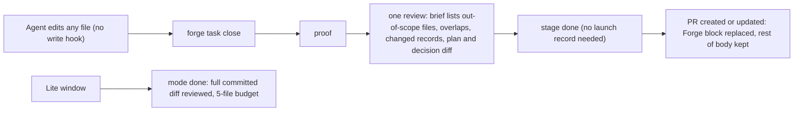

# Full access in code

## What and why

Forge's write lock tries to stop agents from writing files by guessing, from each shell command,
whether it writes. That guess can never be complete: each review found a new way around it, each
patch added code, and harmless commands kept getting refused. This task deletes the lock and makes
the end of the task do the judging instead. Proof, one clean review and CI still decide whether
work ships, and every pull request still needs a ticket.

After this task:

- No hook refuses a write because of the file it touches. Claude, Codex and their helpers can edit
  any file, including records and files in other worktrees.
- `forge task close` runs the same proof, review and seal but no longer asks for a recorded Codex
  run. Files the task changed outside its declared scope are shown to the reviewer and in a
  block of the pull request description that Forge owns. So is any changed file that another
  active task, in any story, also declared. Changed records, plans and decisions are listed
  separately, with the text diff of the plans and decisions. Re-running close replaces only that
  block.
- Correcting a task's scope in the middle of a stage records without a Codex run.
- A Lite window is reviewed on everything it committed and allows at most five changed files,
  not counting tests or Markdown.
- Degraded mode and the old quickfix window are gone. Their commands say they were removed. Old
  closed records still count for the PR ticket check. A legacy window left open is closed with
  `forge mode abandon --reason`, and Forge's messages say so.
- A superseded spec still satisfies the roadmap stories that already link to it, but a new link
  needs a confirmed spec. This task adds only that rule; marking a real spec superseded is part of
  the docs work.
- These stay refused: destructive commands, raw `codex exec` and direct companion launches, the
  check-script bypass, and phase-advancing scripts before sign-off. The question gate and the
  commit check stay too.

Canon and skill text is the next task. This task changes only the code and the messages the code
prints.

## Workflow

## Manual Verification

1. With an approved plan and an active task, an Edit, a Write and a Bash write to a product file,
   a canon doc, a `.factory/` record and a file in another worktree all pass the hook. Running
   `rm -rf build`, `git push --force`, raw `codex exec` or a direct companion launch is still
   refused, and so is `record_decomposition_from_json.py` before sign-off.
2. In a task whose branch changes a file outside its declared scope, with no scope amendment and
   no recorded Codex launch, `forge task close` passes proof and review and opens the PR. The
   review brief and the PR's Forge block both list that file. Both also name every changed file,
   inside or outside the task's scope, that another active task in any story also declared.
   Changed `.factory/`, `plans/` and `docs/decisions/` files are listed as records, never as
   out-of-scope files. The brief also carries the text diff of the changed plans and decisions,
   including uncommitted edits.
3. After adding text and a `Ticket:` line to that PR's description by hand, re-running
   `forge task close` changes only the Forge block. The hand-written text and the Ticket line
   stay. If `gh pr edit` fails, close still succeeds and prints a warning with the retry command.
4. During an active stage, recording a decomposition that adds a path to the task's write scope
   succeeds with no launch record. The receipt is tied to the active stage, and the task grill
   stays valid.
5. A Lite window that commits six non-test, non-Markdown files, including a file under `docs/`
   or `plans/`, is refused at `forge mode done`. The Lite review covers every committed path,
   `.factory/` and `plans/` included.
6. `forge mode degraded start --reason x`, `forge mode degraded done`, `forge quickfix start x`
   and `forge quickfix done` each exit non-zero saying the command was removed, and change no
   files. A PR whose `Ticket:` names an old closed quickfix or degraded record still passes
   `check_pr_ticket.py`. With a legacy quickfix window left open, `forge mode lite` and
   `forge task close` both refuse and name `forge mode abandon --reason`, and that command closes
   the window.
7. `check_dual_runtime.py` and `forge doctor` pass on the shipped hook files. Each fails if Edit,
   Write, MultiEdit or NotebookEdit is routed to the Claude hook, or `apply_patch` to the Codex
   hook. Every `path::test` selector in the scaffold workflow names a test that exists, in any
   test file, so a misspelled selector fails the suite.
8. With a fixture spec marked superseded, plan save, roadmap derive and sign-off still accept the
   roadmap stories that already link to it, and `forge next` does not list it as a draft. A new
   link to it through `roadmap add`, `roadmap fill` or `roadmap link-spec` is refused because
   the spec is not confirmed.

## Risks

- An out-of-scope edit is now caught by the reviewer, not refused. The brief lists those files
  so the reviewer does not miss them. This is the trade the story chose.
- The out-of-scope list is part of the reviewed brief, and the review record depends on that
  brief. If the list picked up files that close writes itself, re-running close would redo the
  review every time. The list therefore leaves out the files close writes after the review: the
  task's own proof folder and the stage tracker. If any other record changes between the review
  and the seal, close reviews again. That is intended, because the reviewer has to see the change.
- `.factory/` records can be edited by hand. They are checked for consistency, not signed, which
  was already true under the lock.
- This task is big. It touches about 30 source and config files and 12 test files, deletes about
  100 tests and changes about 40. Most of the change is deletion; the new logic is roughly 250
  lines. If it runs over one session, split it in two: first delete the lock and its tests, then
  change close, Lite, the removed commands and the spec rule.

---

## Technical notes

- Hook (`factory/scripts/pre_tool_use.py`): keep `deny`, `_raw_payload`, the ask gate (197-209),
  the destructive denylist (`blocked`, 1338-1347), the codex-exec and companion bans
  (`CODEX_EXEC_INVOCATION`, `_active_codex_exec_match`, `_wrapped_codex_exec`, 1353-1602 and
  1842-1969), the check bypass (1604-1609), the sign-off gate (1611-1626, 1971-1980) and the commit
  belt (1690-1709). Also keep the helpers the belt needs: `tokenize`, `PREFIX_VALUE_OPTIONS`,
  `_shell_command_index`, `split_shell_segments`, `HEREDOC_START`, `strip_heredoc_bodies`,
  `git_subcommand` and `has_git_commit`. Delete everything else. That covers `EDIT_TOOLS` and
  `PATCH_TOOL`, the worktree re-rooting (48-69, 1628-1647), the unmerged-path policy (71-83,
  1648-1659), the static fallback lock (85-169), the lock messages and `.factory` state
  (212-273), the Bash write parser (285-626 except the kept helpers, 641-982, 1000-1336), the
  opaque/cd checks (1672-1688) and write admission (1711-1841). The hook no longer imports
  `quickfix` or `repo_kind`. If a Forge import fails, the hook still runs the checks that need
  no import (the destructive denylist and the codex-exec and companion bans). It also refuses
  phase-advancing scripts, because sign-off cannot be read, and allows everything else. If run
  state cannot be read, the sign-off gate stays armed.
- `worker_admission.py`: delete `native_stage_admission`, `_revocation_path`,
  `revoke_worker_admission`, `worker_admission_revoked`, `_lite_contract` and `_stage_contract`.
  Cut `live_worker_admission` down to its identity half, 287-330 (token → one bound live row
  whose process tree contains the caller), and rename it `live_worker`. Keep
  `live_native_read_only_grill` without its revocation checks, plus `path_in_scope`,
  `parse_native_grill_label`, `_bound_rows` and `_current_process_descends_from`.
  `stop_continue.py:55-65` calls `live_worker` and keeps the grill check.
- `delegate.py`: delete `_revoke_native_write_admission` (708-713) and the `before_cleanup`
  plumbing in `_wait_and_reap` (745-781; callers 2329, 2349, 2372, 2399). The launch readiness
  gate (1991-1999) is unchanged and checks the new hook contract below.
- `repo_kind.py`: keep only `is_harness_source_repo`. Delete `locked_repo_path`, its helpers and
  the three prefix constants.
- Hook wiring: remove the `Edit|Write|MultiEdit|NotebookEdit` PreToolUse entry from
  `.claude/settings.json` (34-42). In `.codex/hooks.json` change the matcher to
  `Bash|request_user_input` (27). `check_dual_runtime.py` (400-434): coverage becomes Claude
  `Bash, AskUserQuestion` and Codex `Bash, request_user_input`. Add an absence rule that no
  PreToolUse matcher may cover `Edit`, `Write`, `MultiEdit`, `NotebookEdit` or `apply_patch`; an
  empty or `*` matcher counts as covering them. Expose it as one function that doctor also calls
  in a `hook-registration` row. `doctor.codex_hook_readiness` (1107-1111) requires
  `Bash, request_user_input` and fails when `apply_patch` is covered.
- Close: delete `_require_successful_launch`, `_host_window_covering`,
  `_successful_launch_entry_valid`, `_host_native_preparation_scope` and
  `_host_native_preparation_valid` (`stages.py` 1633-1873). Delete their calls in `_finish_stage`
  (4362, 4372, 4395), the `host_window` record (4407-4412), the list line (4726-4727) and
  `close.py:89,146`. Reword the launch notes (1616-1618, 4645-4646).
- Scope report: one new `stages.scope_report(base, task_id)` returns `outside`, `overlaps`,
  `records` and `record_diff`. Changed paths are `git diff --name-only -z <stage base>`, which
  covers committed and working-tree changes on every path. Base is
  `stage_baseline(base, stage)`. Untracked files are not in that diff, and close already stops
  on untracked product paths (`review._product_dirty`). Only two things are excluded: the task's
  own proof folder (`task_evidence_path(base, story, task_id, "")`) and `.factory/stages.json`.
  - `records`: every other changed path under `.factory/`, `plans/` or `docs/decisions/`, in or
    out of the declared scope. These paths go ONLY to `records`, never to `outside`.
  - `outside`: every remaining changed path not covered by the DECLARED `task["write_scope"]`,
    using `classify_scope_entries` and `_covered`, with no `measure_prefixes`. Scope amendments
    do not narrow it.
  - `overlaps`: every changed path, in scope or out, covered by the declared `write_scope` of
    another active stage in ANY story of the repo. Get those stages from
    `stages.active_stages_everywhere(base, any_story=True)`. The new keyword skips the issue
    filter (stages.py 901) and deduplicates on (issue, stage id) instead of the id alone.
    Resolve each stage's task with `task_for(root, stage_id)`. Each entry names the path, the
    other task and its story.
  - `record_diff`: `git diff <stage base> -- plans/ docs/decisions/`, which includes the working
    tree.
  - Consumers: `close.py:141-145` prints `outside` and `overlaps` (advisory, no refusal).
    `review_brief._task_section` (419) adds a `### Changes outside the declared scope` section
    for the reviewed task only, so the output is byte-stable for a fixed tree.
- PR block (`tasks.seal_task`, 715-747): the body ends with `<!-- forge:scope -->` … `<!--
  /forge:scope -->`, holding outside files, overlaps and records. When the PR already exists,
  read the body with `gh pr view --json body`, replace the marked block or append it, and write
  it with `gh pr edit --body`. A failed view or edit prints a warning and the retry command
  (`./forge task close <id>`) and returns normally. Use `encoding="utf-8"` with no
  surrogateescape, so no new encoding pin is needed.
- Stage-bound amendments: in `record_decomposition_from_json._measurement_receipt` (374-399, 415),
  delete the launch lookup and the `launch_id` field. The receipt is already tied to the stage by
  `stage_started_at` and `stage_base_sha`. In `factory_lib`, delete `validated_measurement_launch`
  (3866-3962). `_measurement_receipt_chain_matches` (3982-3998, 4032-4034) treats `launch_id` as
  optional legacy (a string when present), and `_measurement_continuity_matches` returns True
  once the chain matches (4095-4103). `_bootstrap_measurement_source` is unchanged; with no launch
  row it returns None, as it does today.
- Lite (`quickfix.py`): `_lite_manifest` becomes the plain `git diff --name-only -z
  base..HEAD` list, dropping the marker refusal, symlink split and `_lite_product_files`.
  `_counts_toward_budget` is unchanged. Remove the repo-kind pin: the `harness_source` field
  (163-167), `_require_harness_marker` and `_require_lite_repo_kind`. Also remove `claim_files`.
  `review.review_lite` (2013-2019, 2055, 2083) takes every committed path with no exclusion and
  uses `tip_sha` as the review tip. `fix.finish_fix_close` (136-141) stages `dirty` directly.
  `factory_lib.task_seal_shared_problems` (5979) filters dirty paths with
  `product_excluded_prefixes` instead of `_lite_product_files`.
- Removed commands: in `forge.py` (325-336, 357-367), `quickfix` and `mode degraded` each take a
  `REMAINDER` argument and call one `quickfix.cmd_removed`, which fails with "removed; use
  `./forge mode lite` for a small fix". Delete `cmd_start`, `cmd_done`, `cmd_list`,
  `cmd_degraded_start`, the QUICKFIX/DEGRADED branches of `_open` and `cmd_mode_done`, and the
  `DEGRADED` constant's users. `cmd_mode_abandon` (quickfix.py 256-281) already closes a window
  of any profile, writing an `abandoned` event. It stays; only its `_require_harness_marker`
  call goes. Legacy open quickfix or degraded windows point there:
  - the open-window refusal in `_open` (144-148) says `./forge mode abandon --reason "<why>"`
    for those profiles and `./forge mode done` for Lite;
  - `factory_lib.task_seal_shared_problems` (5963-5970) does the same.
  `load_events`, `closed_windows` and `check_pr_ticket.completed_windows` are unchanged, so old
  closed records keep counting.
- Superseded specs: `specs.py` adds `SETTLED = ("confirmed", "superseded")`.
  `resolve_spec_reference(..., existing=True)` accepts SETTLED; the default stays confirmed only.
  Pass `existing=True` in `plans.py:304` and in `roadmap.py:367` when the stored roadmap already
  links that key to that spec. `roadmap.py` 547, 621 and 704 stay confirmed-only.
  `record_signoff.py:58-62`, `phase.py:344` and `board.py:466,485` treat SETTLED as not draft.
  Tests use a fixture spec. Marking `docs/specs/strict-role-split.md` superseded belongs to the
  docs task, not this one.
- Guidance: reword to the Lite fix or to direct editing plus close. That covers `phase.py:503-509`,
  `signal.py:28-29,78-80`, the `factory/schemas/signal.json` `kind_note`, `review.py:1101-1103`,
  `factory_lib.py:5703-5704`, `session_start.py:62-88` (drop the lock line and the quickfix
  branch) and the `scaffold.py` onboarding (226-228). Also remove the `docs/degraded-mode.md` row
  (46) from `DOC_CONTRACTS` so the DOCS task can delete the file.
- `check_encoding_hygiene.py:53-55`: drop the pins for deleted hook code. Keep the `quickfix.py`
  `_git_paths` line so its pin still holds.
- Windows job (`factory-scaffold.yml` 122, 142-143): drop the lockout and degraded selectors and
  point line 122 at `test_registered_hook_path_keeps_recorder_armed`. That test is the old
  8096 test, sending a `codex exec` Bash payload through the registered command instead of an
  Edit. Also add `factory/tests/test_full_access.py::test_retained_command_gates_still_refuse`.
- Selector check: `test_ci_locale_forcing_selectors_reference_existing_tests` (test_gates
  10707-10725) today parses only `test_gates.py` selectors. Extend it to every
  `factory/tests/<file>.py::<name>` selector in `factory-scaffold.yml`: each file must exist,
  and `<name>` must be a top-level test function in that file, found by `ast` as today. A
  misspelled `test_full_access` selector then fails.
- New tests, in `factory/tests/test_full_access.py`: `from test_gates import HARNESS, git, hook,
  repo, run  # noqa: F401`. Importing the `repo` fixture by name registers it with pytest, which
  is the pattern other test files already use; there is no conftest.py. One test per Manual
  Verification item, plus the PR-edit failure case.
  `gh` is faked with a PATH stub that records its argv and holds the PR body in a file.
- Guard-only tests to DELETE (104):
  - `test_gates.py` (70): 2973, 2989, 7813, 7922, 7940, 8072, 8132, 8481, 8507, 8559,
    8631-9048 (the 23 bash/git/sed lock tests), 9079, 9148, 9163, 9191, 9232, 9265, 9279,
    9316, 9360, 9386, 9447, 9473, 9495, 9697, 9726, 9751, 9788, 9810, 9831, 9848, 9866, 9902,
    9922, 9939, 10160, 10306, 10344, 17899, 17921, 17943, 17958, 18382, 18415, 19395, 23731,
    23755, 24431. Also remove the helpers left dead: `make_unmerged`, `native_hook`,
    `_seed_valid_launch` and `PLANNING_LOCK_DECISION_FIXTURE`.
  - `test_worker_admission.py` (27): 232, 266, 288, 315, 337, 387, 407, 437, 709, 728, 744,
    770, 794, 805, 813, 829, 843, 867, 916, 948, 964, 988, 1026, 1095, 1108, 1145, 1159.
  - `test_seal_measures.py` (2): 41 and 65, plus the `_claim` helper and the docstring lines.
  - `test_close_binds_to_the_diff.py` 124; `test_delegate_scope.py` 231;
    `test_review_task_delta.py` 983, 1070 and 1100.
- Tests to CHANGE (about 39):
  - `test_gates.py`: 10707 (selector check, as above), 2955, 7665, 7897 (fallback now allows writes but still refuses the kept
    gates), 8096 (rename, as above), 8415, 9955, 10040, 10110, 10381 (removed message),
    13316, 13339, 13353, 13550, 15189, 15465, 17532, 17884, 18050, 20225, 20245 and 22446
    (quickfix fixtures become Lite), plus the stale `"stage_done": ["delegate"]` entry
    (14537).
  - `test_worker_admission.py`: 557 and 1169 (`live_worker`), 1041, 1230 (no revoked case).
  - `test_close_binds_to_the_diff.py`: 453, 564, 668, plus 306, which must still pass without
    a launch fixture.
  - `test_delegate_scope.py` 175; `test_native_setup.py` 39, 139, 214 and 485 (`HOOK_TOOL_MATRIX`
    plus absence); `test_regrill_scope.py` 605, 661 and 717 (flipped: the amendment now
    records); `test_raw_writes_keep_bytes.py` 59 (rename to
    `test_delegation_ledger_keeps_bytes`); and the import on `test_native_launch.py:31`.
