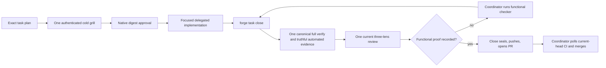

## Problem

PR #229 still repeats approval and verification work, and its first complete close exposed stale fixture proof plus a 38-minute red suite. This task finishes the approved Lean recovery without weakening approval, migration, review, functional, or platform gates. It also repairs the current PR-link records and leaves the remaining legacy-family consolidation to Portable.

## Scope and boundaries

Lean owns native story/task approval, one cold-read disposition bridge, narrowed delegation, secure optional grill context, content-bound proof reuse, one-time Lean and sealed fixed-review migration, three Forge-owned profiles, current per-event PR-link repair/backfill, the close-owned proof path, and aligned docs/tests.

Portable owns the later full event-family and bookkeeping consolidation. Native lifecycle and Shared coordinator work remain in their existing tasks. No scheduler, cache, new evidence schema, client rollout, global user configuration, or skipped coverage is authorized.

The later explicit user-authorized PR229 amendment classifies the already-present read-only board wording change as `user_facing: true` solely to add stricter functional proof. It does not transfer Shared’s board/owner feature ownership or add new UI behavior.

## Workflow

Workers run focused checks only. `forge task close` is the sole final proof owner: it runs or exact-identity reuses the canonical full verification, derives truthful automated evidence from that execution before review, consumes canonical JUnit for required nodes only when every exact declared id passes unambiguously, otherwise runs the dedicated selectors, then performs review and stops if functional proof is missing. The coordinator runs the functional checker, records it, reruns close to seal/push/open or find the PR, then separately polls current-head CI and performs the authorized merge.

## Implementation contract

- Native approval uses the shared recorder and only successful Claude `ExitPlanMode` or exact synchronous Codex approval events. It binds one current candidate, final digest, runtime, session/event identity, plan kind/story/task, replay refusal, and `human-via-*` attribution.
- The authenticated cold input remains immutable. Ordered finding dispositions and explained byte deltas bridge it to the final plan; no record claims the reader saw amended bytes.
- `delegate --scope` accepts only a proper subset of effective scope. Exact approved files are valid; omission keeps full scope. Normal and narrowed briefs both state that workers run focused checks and close owns task-wide proof.
- `--context-file` remains optional for `forge grill run`. When supplied, its no-follow, stable identity, UTF-8/capacity, owner-only POSIX or Windows ACL, snapshot, cleanup, and metadata-only evidence rules are mandatory.
- Test and verify reuse bind product bytes, exact argv/selectors, runner/interpreter/dependency metadata, pytest and verifier configuration, relevant environment, and generated semantic inputs. Missing, partial, unknown, or drifted identity reruns. Selected review also binds Decision 0066 delta plus current task meaning, automated evidence, review instructions, helper/config, and immutable raw provenance.
- Lean migration requires clean-target zero-write refusal, no `--force` bypass, independent raw no-follow inventory coverage, exact-once classification, hashes, temporary build, validation, atomic publication/readback, and deletion only after durable output. A validated original empty completion may create one bound `lean-workflow-v2-supplement.json` when later merged history introduces eligible proof; every other unequal/partial retry refuses.
- Restore proposed historical `0049-per-task-review-proof.md` unchanged. Renumber the accepted full-access decision to the next unused id and update references; numeric reuse and decision deletion are forbidden.
- Current PR-link repair stages `.factory/events/` and backfills only verified merged PR #109/#110 through `forge pr-link`. The effective scope includes the required new Decision 0079 destination and the conditional Lean supplement manifest.

## Acceptance Criteria

1. Native approval path: story/task plans approve through the supported Claude and Codex native approval events, not the old manual/board route.
2. Shared recorder identity: the shared approval recorder binds exactly one current-frontier candidate, current digest, runtime, stable session/event identity, plan kind/story/task, replay refusal, and `human-via-Claude` / `human-via-Codex` attribution.
3. Ceremony removal: requirements grill, round floors, old round ledgers as authority, fake frontier questions, second unchanged save, and manual plan/task approval leave normal runtime; Lean preserves one independent cold grill plus complete finding disposition, including the three requirements cold-read gap dispositions for context snapshot security, independent migration coverage, and clean-target preservation, explained amendment bridge to the final artifact digest, final human approval on that digest, and refusal for unexplained out-of-disposition changes.
4. Narrowed delegation: `forge delegate --scope` is a proper-subset narrowing feature, exact approved files are valid subset members, no flag keeps full effective scope, and hook admission enforces the narrowed launch identity.
5. Content-bound close reuse: test/verify receipts and selected-review reviewed-meaning identity reuse only when their proof-type inputs match; substantive acceptance/security/migration/evidence/review-instruction/product-delta changes force review, while canonicalized bookkeeping/timestamp changes preserve immutable original provenance.
6. Lean migration: `forge upgrade` performs clean-checkout preflight with no `--force` bypass, full inventory/hash/classification, independent raw no-follow coverage over fixed legacy roots/exact parents, temp build, validation, publish/readback, profile/settings preservation, and deletion only after durable current outputs exist. Byte-identical retry passes and unequal partial retry refuses, except that a validated original empty completion may publish one bound `lean-workflow-v2-supplement.json` when later merged history introduces newly eligible proof.
7. Fixed-proof migration: Lean migrates sealed fixed-lens proof once into canonical `origin=upgrade` selected generations with the full sealed-proof safety contract, while active old proof requires a fresh review and normal runtime never uses direct fixed-file fallback authority.
8. Hook/config/profile target: committed Claude/Codex hook matrices, `.codex/config.toml`, `.claude/CLAUDE.md`, and profile installation match the recovery target; only three Forge-owned profiles remain while client-modified/client-added profiles are preserved.
9. PR-link workflow staging: `.github/workflows/pr-link.yml` stages per-event `.factory/events/` files and updates its status/comment wording without returning to `.factory/events.jsonl` writes.
10. Verified PR-link backfill: only verified PR #109 and #110 links are backfilled through `forge pr-link`, producing recorder-generated event files and clearing those board-completeness failures without touching unrelated spec gaps.
11. Normal-runtime refusal: Lean-removed old formats outside upgrade produce `run forge upgrade` guidance; PR3-owned legacy families stay compatible until Portable handles them.
12. Docs/runtime agreement: workflow, docs, specs, prompts, skills, architecture text, reviewer focus, required tests, and design-review status agree with the implemented runtime without duplicating long canon in `AGENTS.md`.
13. Single final proof owner: workers run focused checks only; `forge task close` runs the one canonical full verification suite, records truthful complete automated evidence from that execution before review, and normal plus narrowed delegate briefs state that boundary.
14. Exact-identity reuse: any reused test or verification result binds the full product, command, selector, tool, dependency, configuration, environment, and generated-input identity; missing, partial, unknown, or drifted identity refuses reuse.
15. Canonical selector proof: when the canonical pytest/JUnit execution truthfully proves every exact declared required-test node id, close consumes that report instead of rerunning selectors; any missing or ambiguous id retains the dedicated required-selector execution and refusal.
16. Measured concurrency: the canonical pytest worker count changes from `-n 4` only if an identical controlled 4/6/8 comparison shows a material repeatable improvement without new failures or instability; otherwise `-n 4` remains.
17. Prepared fixture optimization: shared initialized/scaffolded test fixtures may be introduced only when measured faster while retaining real init, fresh-install, path-boundary, provenance, and client-scaffold coverage; no required coverage is skipped or weakened.

## Performance and fixture decision

Benchmark the identical workload `factory/tests/test_upgrade_lean_workflow.py factory/tests/test_native_setup.py factory/tests/test_close_binds_to_the_diff.py` with `UV_CACHE_DIR=/tmp/forge-lean-uv-cache UV_TOOL_DIR=/tmp/forge-lean-uv-tools uv run --python 3.11 --with pytest --with pytest-xdist --with psutil python -m pytest <workload> -q -n N --dist worksteal`. After one warm-up, run twice in order 4/6/8 then 8/6/4. The implementer records each exact command, exit status, wall time, medians, and decision in the existing automated `tests.json` through `record_test_from_json.py`; close preserves these focused commands while adding its canonical result. Change `-n 4` only if another count is at least 10% faster by median, both runs pass, and its timings differ by no more than 15%.

Profile setup time from the same two baseline runs. Attempt a prepared fixture only if repeated init/scaffold setup consumes at least 25% of wall time. Compare two baseline and two prepared runs, adopt only for at least 10% median improvement with all tests passing, and record the measured predicate, commands, timings, and decision in the same schema-validated automated `tests.json`. Real init, fresh-install, path-boundary, provenance, client-scaffold, and native-platform selectors remain executable in every outcome.

## Current implementation blockers

The last canonical run at `a835534` reported 36 failures, 1252 passes, and 4 skips. Shared causes are already diagnosed: review fixtures lack current content-bound receipts; lifecycle expects the pre-reapproval final digest instead of rebinding; full-scope worker admission classifies the same scope twice; migration uses a raw replace outside the boundary helper; and PR-ready/review fixtures carry stale proof identities. The four new required selectors are implementation outputs and must exist before close. `test_board_reads_task_proof.py` and `test_review_reads_the_repo.py` are now in protected scope.

The branch-only review delta from advanced base `aa8b519c1e1e` measured 116 files / 21,828 lines before this compact-plan change. The operative ceiling is 118 files / 23,000 lines. The authoritative contract has 134 allowed paths, 55 required selectors, and 17 criteria; the allowlist count is intentionally distinct from the measured review ceiling.

## Verification Plan

1. Implement and run focused regressions for each shared failure cause and AC13-17. Do not run the broad suite during fix iteration.
2. Run the declared 4/6/8 benchmark and conditional fixture profile; retain `-n 4` and current fixtures unless the numeric adoption gates pass.
3. Commit product changes, then run `./forge task close LEAN-WORKFLOW`. Close owns the only canonical full suite, JUnit/selector proof, truthful automated record, and current review.
4. The final task approval needs one supported runtime event. The main coordinator records the compact plan through real Claude `ExitPlanMode`; deterministic hook/recorder tests cover the Codex adapter and the other Claude refusal paths. Decision 0053 does not require an unfinished-task coordinator transfer, and no second live approval artifact is invented.
5. Reverify `gh pr view 109` and `gh pr view 110`, current board completeness, dual-runtime, encoding, and diff checks through declared proof.
6. Because this task is user-facing, run and record the functional checker after clean review and before sealing.

## Manual Verification

1. Run `git merge-base HEAD origin/main` and confirm `aa8b519c1e1e`; record `git rev-parse HEAD` separately as the task tip.
2. Inspect the rendered contract for exactly 17 criteria/contracts, 55 required tests, 134 allowed paths, `user_facing: true`, and the 118-file/23,000-line budget.
3. Exercise one accepted and rejected native approval event and confirm only the accepted current digest writes authority with stable runtime/session/event identity.
4. Print a narrowed exact-file delegation and a full-scope delegation; confirm both briefs assign task-wide proof to close and hooks refuse writes outside the selected scope.
5. Change one input in each reuse identity family and confirm only the affected proof reruns; missing identity always reruns.
6. Inspect canonical JUnit consumption for exact required ids, then remove or make one id ambiguous and confirm dedicated selector fallback/no-match refusal.
7. Run migration dirty, linked, conflicting, empty-original supplement, byte-identical retry, and unequal retry fixtures; confirm zero-write refusal and readback.
8. Confirm Decision 0049 history, board wording, functional proof, and recorder-generated #109/#110 events before PR publication.

<!-- forge:contract -->
## Contract (recorded)

Rendered by the harness from the recorded decomposition; edit the decomposition, not this block. It is excluded from the plan's approval and grill digests, so a re-render never stales either.

**Objective.** install recovery PR2 by replacing repeated approval/round ceremony with native approval, one cold grill with complete finding disposition, narrowed delegation, mandatory context-file security, content-bound close reuse in existing stage state, Lean-owned migration/deletion for removed formats including sealed fixed-proof migration, three-profile Forge registry reduction, PR-link workflow repair/backfill, docs/spec/architecture/runtime alignment, and the amended Portable PR3 handoff, plus one close-owned canonical full-suite proof path with exact-identity reuse, canonical JUnit selector proof, measured concurrency, and coverage-preserving fixture optimization.

**Acceptance criteria**

- Native approval path: story/task plans approve through the supported Claude and Codex native approval events, not the old manual/board route.
- Shared recorder identity: the shared approval recorder binds exactly one current-frontier candidate, current digest, runtime, stable session/event identity, plan kind/story/task, replay refusal, and `human-via-Claude` / `human-via-Codex` attribution.
- Ceremony removal: requirements grill, round floors, old round ledgers as authority, fake frontier questions, second unchanged save, and manual plan/task approval leave normal runtime; Lean preserves one independent cold grill plus complete finding disposition, including the three requirements cold-read gap dispositions for context snapshot security, independent migration coverage, and clean-target preservation, explained amendment bridge to the final artifact digest, final human approval on that digest, and refusal for unexplained out-of-disposition changes.
- Narrowed delegation: `forge delegate --scope` is a proper-subset narrowing feature, exact approved files are valid subset members, no flag keeps full effective scope, and hook admission enforces the narrowed launch identity.
- Content-bound close reuse: test/verify receipts and selected-review reviewed-meaning identity reuse only when their proof-type inputs match; substantive acceptance/security/migration/evidence/review-instruction/product-delta changes force review, while canonicalized bookkeeping/timestamp changes preserve immutable original provenance.
- Lean migration: `forge upgrade` performs clean-checkout preflight with no `--force` bypass, full inventory/hash/classification, independent raw no-follow coverage over fixed legacy roots/exact parents, temp build, validation, publish/readback, profile/settings preservation, and deletion only after durable current outputs exist. Byte-identical retry passes and unequal partial retry refuses, except that a validated original empty completion may publish one bound `lean-workflow-v2-supplement.json` when later merged history introduces newly eligible proof.
- Fixed-proof migration: Lean migrates sealed fixed-lens proof once into canonical `origin=upgrade` selected generations with the full sealed-proof safety contract, while active old proof requires a fresh review and normal runtime never uses direct fixed-file fallback authority.
- Hook/config/profile target: committed Claude/Codex hook matrices, `.codex/config.toml`, `.claude/CLAUDE.md`, and profile installation match the recovery target; only three Forge-owned profiles remain while client-modified/client-added profiles are preserved.
- PR-link workflow staging: `.github/workflows/pr-link.yml` stages per-event `.factory/events/` files and updates its status/comment wording without returning to `.factory/events.jsonl` writes.
- Verified PR-link backfill: only verified PR #109 and #110 links are backfilled through `forge pr-link`, producing recorder-generated event files and clearing those board-completeness failures without touching unrelated spec gaps.
- Normal-runtime refusal: Lean-removed old formats outside upgrade produce `run forge upgrade` guidance; PR3-owned legacy families stay compatible until Portable handles them.
- Docs/runtime agreement: workflow, docs, specs, prompts, skills, architecture text, reviewer focus, required tests, and design-review status agree with the implemented runtime without duplicating long canon in `AGENTS.md`.
- Single final proof owner: workers run focused checks only; `forge task close` runs the one canonical full verification suite, records truthful complete automated evidence from that execution before review, and normal plus narrowed delegate briefs state that boundary.
- Exact-identity reuse: any reused test or verification result binds the full product, command, selector, tool, dependency, configuration, environment, and generated-input identity; missing, partial, unknown, or drifted identity refuses reuse.
- Canonical selector proof: when the canonical pytest/JUnit execution truthfully proves every exact declared required-test node id, close consumes that report instead of rerunning selectors; any missing or ambiguous id retains the dedicated required-selector execution and refusal.
- Measured concurrency: the canonical pytest worker count changes from `-n 4` only if an identical controlled 4/6/8 comparison shows a material repeatable improvement without new failures or instability; otherwise `-n 4` remains.
- Prepared fixture optimization: shared initialized/scaffolded test fixtures may be introduced only when measured faster while retaining real init, fresh-install, path-boundary, provenance, and client-scaffold coverage; no required coverage is skipped or weakened.

**Write scope** (what `stage done` measures the diff against)

- AGENTS.md
- WORKFLOW.md
- docs/FACTORY.md
- docs/QUALITY.md
- docs/ROLES.md
- docs/getting-started.md
- docs/architecture/dual-coordinator-parity.md
- docs/specs/dual-coordinator-parity.md
- docs/specs/plan-approval.md
- docs/specs/delegation-boundary.md
- docs/specs/project-hierarchy.md
- docs/specs/conflict-free-story-state.md
- factory/skills/forge.md
- factory/prompts/planner.md
- factory/prompts/griller.md
- factory/prompts/decomposer.md
- factory/prompts/reviewer.md
- harness.yaml
- .codex/config.toml
- .codex/hooks.json
- .claude/settings.json
- .claude/CLAUDE.md
- .github/workflows/pr-link.yml
- .codex/agents/architect.toml
- .codex/agents/backend.toml
- .codex/agents/debugger.toml
- .codex/agents/explorer.toml
- .codex/agents/frontend.toml
- .codex/agents/griller.toml
- .codex/agents/lite.toml
- .codex/agents/performance.toml
- .codex/agents/planner.toml
- .codex/agents/refactorer.toml
- .codex/agents/security.toml
- .codex/agents/tester.toml
- factory/scripts/forge.py
- factory/scripts/factory_lib.py
- factory/scripts/pre_tool_use.py
- factory/scripts/post_tool_use.py
- factory/scripts/check_dual_runtime.py
- factory/scripts/session_start.py
- factory/scripts/record_grill_from_json.py
- factory/scripts/grill_gates.py
- factory/scripts/record_decomposition_from_json.py
- factory/scripts/record_test_from_json.py
- factory/scripts/verify.py
- factory/scripts/check_task_proof.py
- factory/scripts/forge_cli/plans.py
- factory/scripts/forge_cli/tasks.py
- factory/scripts/forge_cli/phase.py
- factory/scripts/forge_cli/approval.py
- factory/scripts/forge_cli/ceremony.py
- factory/scripts/forge_cli/delegate.py
- factory/scripts/forge_cli/stages.py
- factory/scripts/forge_cli/grill.py
- factory/scripts/forge_cli/readiness.py
- factory/scripts/forge_cli/upgrade.py
- factory/scripts/forge_cli/audit.py
- factory/scripts/forge_cli/close.py
- factory/scripts/forge_cli/review.py
- factory/scripts/forge_cli/review_brief.py
- factory/scripts/forge_cli/signal.py
- factory/scripts/forge_cli/scaffold.py
- factory/scripts/forge_cli/doctor.py
- factory/scripts/forge_cli/board.py
- factory/scripts/forge_cli/codex_runtime.py
- factory/scripts/forge_cli/worker_admission.py
- factory/schemas/lean-workflow-migration.json
- factory/schemas/test-automated.json
- factory/schemas/grill.json
- factory/schemas/grill-round.json
- factory/schemas/plan-mode-marker.json
- factory/tests/test_gates.py
- factory/tests/test_native_setup.py
- factory/tests/test_one_grill.py
- factory/tests/test_round_provenance.py
- factory/tests/test_grill_carries_answers.py
- factory/tests/test_board_approval_gate.py
- factory/tests/test_plan_against_reality.py
- factory/tests/test_gate_table_e2e.py
- factory/tests/test_grill_release.py
- factory/tests/test_ask_gate.py
- factory/tests/test_proof_read_path.py
- factory/tests/test_review_settled_contracts.py
- factory/tests/test_review_task_delta.py
- factory/tests/test_gate_table.py
- factory/tests/test_close_binds_to_the_diff.py
- factory/tests/test_stage_proof_runs_once.py
- factory/tests/test_raw_writes_keep_bytes.py
- factory/tests/test_worker_admission.py
- factory/tests/test_lean_workflow.py
- factory/tests/test_approval_hooks.py
- factory/tests/test_upgrade_lean_workflow.py
- factory/tests/test_delegate_scope.py
- factory/tests/test_proof_reuse.py
- factory/tests/test_pr_link_workflow.py
- factory/tests/test_regrill_scope.py
- .factory/migrations/lean-workflow-v2.json
- .factory/events/
- factory/tests/test_grill_budget.py
- factory/tests/test_lifecycle_end_to_end.py
- factory/tests/test_review_lenses_in_parallel.py
- factory/tests/test_seal_measures.py
- factory/tests/test_stop_less_often.py
- .github/workflows/roadmap-gate.yml
- docs/decisions/0049-per-task-review-proof.md
- docs/decisions/0064-lean-delivery-and-durable-history.md
- docs/decisions/0079-a-task-proof-runs-once-per-tree.md
- docs/decisions/0079-native-role-model-routing.md
- docs/decisions/0080-native-role-model-routing.md
- docs/decisions/0074-user-selects-main-orchestrator-model.md
- plans/active/FORGE-WIN-3-delegation-runs-on-native-windows.md
- plans/active/upgrade-doc-contract-safety-task-plan.md
- factory/scripts/pr_ready.py
- factory/scripts/check_encoding_hygiene.py
- factory/tests/test_requirements_freshness.py
- factory/board/index.html
- .envrc
- factory/scripts/forge_cli/AGENTS.md
- .github/workflows/factory-scaffold.yml
- factory/tests/test_closeout_mode_from_markers.py
- factory/schemas/delegation.json
- factory/tests/test_native_launch.py
- factory/scripts/record_review_from_json.py
- factory/scripts/forge_cli/review_groups.py
- factory/tests/test_review_in_parallel_groups.py
- factory/prompts/implementer.md
- docs/specs/accountable-engineering-loop.md
- factory/tests/test_grill_round_cap.py
- factory/scripts/update_run.py
- factory/scripts/forge_cli/findings.py
- .codex/explore.config.toml
- .codex/agents/functional-checker.toml
- .codex/agents/planner-high.toml
- .codex/agents/docs-decomposer.toml
- docs/decisions/0049-full-access-for-forge-managed-codex-chats.md
- docs/windows.md
- factory/tests/test_board_reads_task_proof.py
- factory/tests/test_review_reads_the_repo.py
- docs/decisions/0079-full-access-for-forge-managed-codex-chats.md
- .factory/migrations/lean-workflow-v2-supplement.json

**Scope amendments** (measured paths the scope did not name, recorded with `forge stage amend-scope`)

- .codex/agents/coder.toml -- Record the user-approved repo-local role profiles, coder rename, and native model routing changes measured in this task.
- .codex/agents/worker.toml -- Apply the user-approved native child model routing decision and distribute the worker role profile.
- README.md -- Align public documentation with the user-approved Luna/Terra/Sol native child routing while keeping Autoreview unchanged.
- docs/degraded-mode.md -- User-authorized native-mode contract amendment requires updating the remaining runtime callers, protected delegation schema, strict role contract, product brief, and degraded-mode guidance so Codex uses role-based host subagents without nested exec or process locks.
- docs/product/BRIEF.md -- User-authorized native-mode contract amendment requires updating the remaining runtime callers, protected delegation schema, strict role contract, product brief, and degraded-mode guidance so Codex uses role-based host subagents without nested exec or process locks.
- docs/specs/strict-role-split.md -- User-authorized native-mode contract amendment requires updating the remaining runtime callers, protected delegation schema, strict role contract, product brief, and degraded-mode guidance so Codex uses role-based host subagents without nested exec or process locks.
- factory/scripts/forge_cli/fix.py -- User-authorized native-mode contract amendment requires updating the remaining runtime callers, protected delegation schema, strict role contract, product brief, and degraded-mode guidance so Codex uses role-based host subagents without nested exec or process locks.
- factory/scripts/record_review_from_json.py -- The public review-generation recorder validation in record_review_from_json.py is required for Lean selected-review input and current reviewed-meaning identity; it was omitted from the task write_scope while its reviewed-meaning caller changed. Stage measurement identified this exact single path, with no other scope addition.

**Required tests** (run by `stage done`)

- `test_native_approval_refuses_zero_multiple_candidates_replay_and_missing_identity` -- `UV_CACHE_DIR=/tmp/forge-lean-uv-cache UV_TOOL_DIR=/tmp/forge-lean-uv-tools uv run --python 3.11 --with pytest --with psutil python -m pytest {path}::{id} -o junit_family=legacy --junitxml={report}` (factory/tests/test_approval_hooks.py)
- `test_native_approval_records_human_via_runtime_identity_without_display_name` -- `UV_CACHE_DIR=/tmp/forge-lean-uv-cache UV_TOOL_DIR=/tmp/forge-lean-uv-tools uv run --python 3.11 --with pytest --with psutil python -m pytest {path}::{id} -o junit_family=legacy --junitxml={report}` (factory/tests/test_approval_hooks.py)
- `test_native_approval_reuses_existing_story_and_task_approval_storage` -- `UV_CACHE_DIR=/tmp/forge-lean-uv-cache UV_TOOL_DIR=/tmp/forge-lean-uv-tools uv run --python 3.11 --with pytest --with psutil python -m pytest {path}::{id} -o junit_family=legacy --junitxml={report}` (factory/tests/test_approval_hooks.py)
- `test_native_plan_mode_approval_records_exact_digest_for_claude_exit_plan_mode` -- `UV_CACHE_DIR=/tmp/forge-lean-uv-cache UV_TOOL_DIR=/tmp/forge-lean-uv-tools uv run --python 3.11 --with pytest --with psutil python -m pytest {path}::{id} -o junit_family=legacy --junitxml={report}` (factory/tests/test_lean_workflow.py)
- `test_native_plan_mode_approval_records_exact_digest_for_codex_sync_approval` -- `UV_CACHE_DIR=/tmp/forge-lean-uv-cache UV_TOOL_DIR=/tmp/forge-lean-uv-tools uv run --python 3.11 --with pytest --with psutil python -m pytest {path}::{id} -o junit_family=legacy --junitxml={report}` (factory/tests/test_lean_workflow.py)
- `test_native_approval_refuses_stale_wrong_runtime_canceled_async_and_unsupported_payloads` -- `UV_CACHE_DIR=/tmp/forge-lean-uv-cache UV_TOOL_DIR=/tmp/forge-lean-uv-tools uv run --python 3.11 --with pytest --with psutil python -m pytest {path}::{id} -o junit_family=legacy --junitxml={report}` (factory/tests/test_lean_workflow.py)
- `test_normal_flow_no_longer_requires_requirements_grill_manual_approval_or_second_save` -- `UV_CACHE_DIR=/tmp/forge-lean-uv-cache UV_TOOL_DIR=/tmp/forge-lean-uv-tools uv run --python 3.11 --with pytest --with psutil python -m pytest {path}::{id} -o junit_family=legacy --junitxml={report}` (factory/tests/test_lean_workflow.py)
- `test_delegate_scope_must_be_strict_subset_of_approved_write_scope` -- `UV_CACHE_DIR=/tmp/forge-lean-uv-cache UV_TOOL_DIR=/tmp/forge-lean-uv-tools uv run --python 3.11 --with pytest --with psutil python -m pytest {path}::{id} -o junit_family=legacy --junitxml={report}` (factory/tests/test_delegate_scope.py)
- `test_delegate_scope_is_bound_to_brief_launch_identity_and_existing_write_scope` -- `UV_CACHE_DIR=/tmp/forge-lean-uv-cache UV_TOOL_DIR=/tmp/forge-lean-uv-tools uv run --python 3.11 --with pytest --with psutil python -m pytest {path}::{id} -o junit_family=legacy --junitxml={report}` (factory/tests/test_delegate_scope.py)
- `test_hook_refuses_write_outside_narrowed_delegate_scope` -- `UV_CACHE_DIR=/tmp/forge-lean-uv-cache UV_TOOL_DIR=/tmp/forge-lean-uv-tools uv run --python 3.11 --with pytest --with psutil python -m pytest {path}::{id} -o junit_family=legacy --junitxml={report}` (factory/tests/test_delegate_scope.py)
- `test_delegate_brief_carries_criteria_and_scope` -- `UV_CACHE_DIR=/tmp/forge-lean-uv-cache UV_TOOL_DIR=/tmp/forge-lean-uv-tools uv run --python 3.11 --with pytest --with psutil python -m pytest {path}::{id} -o junit_family=legacy --junitxml={report}` (factory/tests/test_gates.py)
- `test_native_worker_patch_add_update_delete_and_move_is_admitted` -- `UV_CACHE_DIR=/tmp/forge-lean-uv-cache UV_TOOL_DIR=/tmp/forge-lean-uv-tools uv run --python 3.11 --with pytest --with psutil python -m pytest {path}::{id} -o junit_family=legacy --junitxml={report}` (factory/tests/test_worker_admission.py)
- `test_context_file_security_no_follow_modes_identity_capacity_and_cleanup` -- `UV_CACHE_DIR=/tmp/forge-lean-uv-cache UV_TOOL_DIR=/tmp/forge-lean-uv-tools uv run --python 3.11 --with pytest --with psutil python -m pytest {path}::{id} -o junit_family=legacy --junitxml={report}` (factory/tests/test_delegate_scope.py)
- `test_context_file_launch_uses_one_handle_snapshot_and_metadata_only_evidence` -- `UV_CACHE_DIR=/tmp/forge-lean-uv-cache UV_TOOL_DIR=/tmp/forge-lean-uv-tools uv run --python 3.11 --with pytest --with psutil python -m pytest {path}::{id} -o junit_family=legacy --junitxml={report}` (factory/tests/test_worker_admission.py)
- `test_unchanged_test_verify_and_selected_review_inputs_reuse_success_without_rerun` -- `UV_CACHE_DIR=/tmp/forge-lean-uv-cache UV_TOOL_DIR=/tmp/forge-lean-uv-tools uv run --python 3.11 --with pytest --with psutil python -m pytest {path}::{id} -o junit_family=legacy --junitxml={report}` (factory/tests/test_proof_reuse.py)
- `test_changed_unknown_partial_or_generated_output_identity_forces_fresh_run` -- `UV_CACHE_DIR=/tmp/forge-lean-uv-cache UV_TOOL_DIR=/tmp/forge-lean-uv-tools uv run --python 3.11 --with pytest --with psutil python -m pytest {path}::{id} -o junit_family=legacy --junitxml={report}` (factory/tests/test_proof_reuse.py)
- `test_reuse_identity_is_proof_type_specific_and_reviewed_meaning_bound` -- `UV_CACHE_DIR=/tmp/forge-lean-uv-cache UV_TOOL_DIR=/tmp/forge-lean-uv-tools uv run --python 3.11 --with pytest --with psutil python -m pytest {path}::{id} -o junit_family=legacy --junitxml={report}` (factory/tests/test_proof_reuse.py)
- `test_selected_review_reuses_for_bookkeeping_only_changes_and_preserves_original_provenance` -- `UV_CACHE_DIR=/tmp/forge-lean-uv-cache UV_TOOL_DIR=/tmp/forge-lean-uv-tools uv run --python 3.11 --with pytest --with psutil python -m pytest {path}::{id} -o junit_family=legacy --junitxml={report}` (factory/tests/test_proof_reuse.py)
- `test_selected_review_reruns_for_changed_acceptance_security_migration_or_evidence` -- `UV_CACHE_DIR=/tmp/forge-lean-uv-cache UV_TOOL_DIR=/tmp/forge-lean-uv-tools uv run --python 3.11 --with pytest --with psutil python -m pytest {path}::{id} -o junit_family=legacy --junitxml={report}` (factory/tests/test_proof_reuse.py)
- `test_selected_upgrade_generation_requires_exact_sealed_binding` -- `UV_CACHE_DIR=/tmp/forge-lean-uv-cache UV_TOOL_DIR=/tmp/forge-lean-uv-tools uv run --python 3.11 --with pytest --with psutil python -m pytest {path}::{id} -o junit_family=legacy --junitxml={report}` (factory/tests/test_review_settled_contracts.py)
- `test_selected_review_reviewed_meaning_includes_ci_generated_outputs_and_review_instructions` -- `UV_CACHE_DIR=/tmp/forge-lean-uv-cache UV_TOOL_DIR=/tmp/forge-lean-uv-tools uv run --python 3.11 --with pytest --with psutil python -m pytest {path}::{id} -o junit_family=legacy --junitxml={report}` (factory/tests/test_review_task_delta.py)
- `test_selected_review_reruns_for_substantive_automated_evidence_change` -- `UV_CACHE_DIR=/tmp/forge-lean-uv-cache UV_TOOL_DIR=/tmp/forge-lean-uv-tools uv run --python 3.11 --with pytest --with psutil python -m pytest {path}::{id} -o junit_family=legacy --junitxml={report}` (factory/tests/test_review_task_delta.py)
- `test_lean_migration_refuses_dirty_checkout_before_writing` -- `UV_CACHE_DIR=/tmp/forge-lean-uv-cache UV_TOOL_DIR=/tmp/forge-lean-uv-tools uv run --python 3.11 --with pytest --with psutil python -m pytest {path}::{id} -o junit_family=legacy --junitxml={report}` (factory/tests/test_upgrade_lean_workflow.py)
- `test_lean_migration_force_cannot_bypass_dirty_tree_refusal` -- `UV_CACHE_DIR=/tmp/forge-lean-uv-cache UV_TOOL_DIR=/tmp/forge-lean-uv-tools uv run --python 3.11 --with pytest --with psutil python -m pytest {path}::{id} -o junit_family=legacy --junitxml={report}` (factory/tests/test_upgrade_lean_workflow.py)
- `test_lean_migration_independent_raw_walk_covers_each_candidate_exactly_once` -- `UV_CACHE_DIR=/tmp/forge-lean-uv-cache UV_TOOL_DIR=/tmp/forge-lean-uv-tools uv run --python 3.11 --with pytest --with psutil python -m pytest {path}::{id} -o junit_family=legacy --junitxml={report}` (factory/tests/test_upgrade_lean_workflow.py)
- `test_lean_migration_inventories_hashes_temp_validates_publishes_and_reads_back` -- `UV_CACHE_DIR=/tmp/forge-lean-uv-cache UV_TOOL_DIR=/tmp/forge-lean-uv-tools uv run --python 3.11 --with pytest --with psutil python -m pytest {path}::{id} -o junit_family=legacy --junitxml={report}` (factory/tests/test_upgrade_lean_workflow.py)
- `test_lean_migration_refuses_malformed_mixed_partial_conflicting_or_linked_inputs` -- `UV_CACHE_DIR=/tmp/forge-lean-uv-cache UV_TOOL_DIR=/tmp/forge-lean-uv-tools uv run --python 3.11 --with pytest --with psutil python -m pytest {path}::{id} -o junit_family=legacy --junitxml={report}` (factory/tests/test_upgrade_lean_workflow.py)
- `test_lean_migration_is_idempotent_for_byte_identical_retry_and_refuses_unequal_partial_retry` -- `UV_CACHE_DIR=/tmp/forge-lean-uv-cache UV_TOOL_DIR=/tmp/forge-lean-uv-tools uv run --python 3.11 --with pytest --with psutil python -m pytest {path}::{id} -o junit_family=legacy --junitxml={report}` (factory/tests/test_upgrade_lean_workflow.py)
- `test_lean_migration_forces_fresh_review_for_active_old_proof_and_migrates_only_exact_sealed_proof` -- `UV_CACHE_DIR=/tmp/forge-lean-uv-cache UV_TOOL_DIR=/tmp/forge-lean-uv-tools uv run --python 3.11 --with pytest --with psutil python -m pytest {path}::{id} -o junit_family=legacy --junitxml={report}` (factory/tests/test_upgrade_lean_workflow.py)
- `test_normal_runtime_refuses_lean_removed_formats_with_upgrade_guidance` -- `UV_CACHE_DIR=/tmp/forge-lean-uv-cache UV_TOOL_DIR=/tmp/forge-lean-uv-tools uv run --python 3.11 --with pytest --with psutil python -m pytest {path}::{id} -o junit_family=legacy --junitxml={report}` (factory/tests/test_upgrade_lean_workflow.py)
- `test_codex_hook_readiness_requires_exact_enabled_trusted_source` -- `UV_CACHE_DIR=/tmp/forge-lean-uv-cache UV_TOOL_DIR=/tmp/forge-lean-uv-tools uv run --python 3.11 --with pytest --with psutil python -m pytest {path}::{id} -o junit_family=legacy --junitxml={report}` (factory/tests/test_native_setup.py)
- `test_codex_hook_readiness_accepts_only_identical_inherited_worktree_hooks` -- `UV_CACHE_DIR=/tmp/forge-lean-uv-cache UV_TOOL_DIR=/tmp/forge-lean-uv-tools uv run --python 3.11 --with pytest --with psutil python -m pytest {path}::{id} -o junit_family=legacy --junitxml={report}` (factory/tests/test_native_setup.py)
- `test_model_policy_selects_sol_work_and_luna_lite` -- `UV_CACHE_DIR=/tmp/forge-lean-uv-cache UV_TOOL_DIR=/tmp/forge-lean-uv-tools uv run --python 3.11 --with pytest --with psutil python -m pytest {path}::{id} -o junit_family=legacy --junitxml={report}` (factory/tests/test_native_setup.py)
- `test_active_model_policy_has_no_forbidden_execution_surface` -- `UV_CACHE_DIR=/tmp/forge-lean-uv-cache UV_TOOL_DIR=/tmp/forge-lean-uv-tools uv run --python 3.11 --with pytest --with psutil python -m pytest {path}::{id} -o junit_family=legacy --junitxml={report}` (factory/tests/test_gate_table.py)
- `test_project_agents_init_upgrade_and_preserve_client_additions` -- `UV_CACHE_DIR=/tmp/forge-lean-uv-cache UV_TOOL_DIR=/tmp/forge-lean-uv-tools uv run --python 3.11 --with pytest --with psutil python -m pytest {path}::{id} -o junit_family=legacy --junitxml={report}` (factory/tests/test_gates.py)
- `test_recovery_profile_override_keeps_only_three_forge_profiles` -- `UV_CACHE_DIR=/tmp/forge-lean-uv-cache UV_TOOL_DIR=/tmp/forge-lean-uv-tools uv run --python 3.11 --with pytest --with psutil python -m pytest {path}::{id} -o junit_family=legacy --junitxml={report}` (factory/tests/test_native_setup.py)
- `test_upgrade_preserves_client_profiles_while_removing_retired_forge_profiles` -- `UV_CACHE_DIR=/tmp/forge-lean-uv-cache UV_TOOL_DIR=/tmp/forge-lean-uv-tools uv run --python 3.11 --with pytest --with psutil python -m pytest {path}::{id} -o junit_family=legacy --junitxml={report}` (factory/tests/test_gates.py)
- `test_upgrade_preserves_project_settings_and_refuses_unknown_same_name_profile_rows` -- `UV_CACHE_DIR=/tmp/forge-lean-uv-cache UV_TOOL_DIR=/tmp/forge-lean-uv-tools uv run --python 3.11 --with pytest --with psutil python -m pytest {path}::{id} -o junit_family=legacy --junitxml={report}` (factory/tests/test_gates.py)
- `test_pr_link_workflow_stages_per_event_files_not_legacy_jsonl` -- `UV_CACHE_DIR=/tmp/forge-lean-uv-cache UV_TOOL_DIR=/tmp/forge-lean-uv-tools uv run --python 3.11 --with pytest --with psutil python -m pytest {path}::{id} -o junit_family=legacy --junitxml={report}` (factory/tests/test_pr_link_workflow.py)
- `test_pr_link_workflow_status_description_names_per_event_link_commit` -- `UV_CACHE_DIR=/tmp/forge-lean-uv-cache UV_TOOL_DIR=/tmp/forge-lean-uv-tools uv run --python 3.11 --with pytest --with psutil python -m pytest {path}::{id} -o junit_family=legacy --junitxml={report}` (factory/tests/test_pr_link_workflow.py)
- `test_verified_forge_acc3_and_cfs1_pr_links_make_board_complete` -- `UV_CACHE_DIR=/tmp/forge-lean-uv-cache UV_TOOL_DIR=/tmp/forge-lean-uv-tools uv run --python 3.11 --with pytest --with psutil python -m pytest {path}::{id} -o junit_family=legacy --junitxml={report}` (factory/tests/test_pr_link_workflow.py)
- `test_history_merges_legacy_and_per_file_events` -- `UV_CACHE_DIR=/tmp/forge-lean-uv-cache UV_TOOL_DIR=/tmp/forge-lean-uv-tools uv run --python 3.11 --with pytest --with psutil python -m pytest {path}::{id} -o junit_family=legacy --junitxml={report}` (factory/tests/test_gates.py)
- `test_pr_link_event_survives_a_clone_with_no_remote` -- `UV_CACHE_DIR=/tmp/forge-lean-uv-cache UV_TOOL_DIR=/tmp/forge-lean-uv-tools uv run --python 3.11 --with pytest --with psutil python -m pytest {path}::{id} -o junit_family=legacy --junitxml={report}` (factory/tests/test_gates.py)
- `test_forge_history_shows_the_pr_link` -- `UV_CACHE_DIR=/tmp/forge-lean-uv-cache UV_TOOL_DIR=/tmp/forge-lean-uv-tools uv run --python 3.11 --with pytest --with psutil python -m pytest {path}::{id} -o junit_family=legacy --junitxml={report}` (factory/tests/test_gates.py)
- `test_signal_ruling_hydration_survives_lean_lifecycle_state_changes` -- `UV_CACHE_DIR=/tmp/forge-lean-uv-cache UV_TOOL_DIR=/tmp/forge-lean-uv-tools uv run --python 3.11 --with pytest --with psutil python -m pytest {path}::{id} -o junit_family=legacy --junitxml={report}` (factory/tests/test_gates.py)
- `test_generated_review_inputs_are_included_in_reviewed_meaning` -- `UV_CACHE_DIR=/tmp/forge-lean-uv-cache UV_TOOL_DIR=/tmp/forge-lean-uv-tools uv run --python 3.11 --with pytest --with psutil python -m pytest {path}::{id} -o junit_family=legacy --junitxml={report}` (factory/tests/test_review_task_delta.py)
- `test_native_preparation_rebinds_after_brief_changes` -- `UV_CACHE_DIR=/tmp/forge-lean-uv-cache UV_TOOL_DIR=/tmp/forge-lean-uv-tools uv run --python 3.11 --with pytest --with psutil python -m pytest {path}::{id} -o junit_family=legacy --junitxml={report}` (factory/tests/test_regrill_scope.py)
- `test_one_cold_grill_full_disposition_replaces_round_floors_and_frontier_fake` -- `UV_CACHE_DIR=/tmp/forge-lean-uv-cache UV_TOOL_DIR=/tmp/forge-lean-uv-tools uv run --python 3.11 --with pytest --with psutil python -m pytest {path}::{id} -o junit_family=legacy --junitxml={report}` (factory/tests/test_lean_workflow.py)
- `test_recovery_override_removes_round_ledgers_without_losing_cold_read_proof` -- `UV_CACHE_DIR=/tmp/forge-lean-uv-cache UV_TOOL_DIR=/tmp/forge-lean-uv-tools uv run --python 3.11 --with pytest --with psutil python -m pytest {path}::{id} -o junit_family=legacy --junitxml={report}` (factory/tests/test_lean_workflow.py)
- `test_lean_docs_match_single_cold_grill_runtime` -- `UV_CACHE_DIR=/tmp/forge-lean-uv-cache UV_TOOL_DIR=/tmp/forge-lean-uv-tools uv run --python 3.11 --with pytest --with psutil python -m pytest {path}::{id} -o junit_family=legacy --junitxml={report}` (factory/tests/test_plan_against_reality.py)
- `test_native_approval_no_longer_routes_through_board_or_manual_approve` -- `UV_CACHE_DIR=/tmp/forge-lean-uv-cache UV_TOOL_DIR=/tmp/forge-lean-uv-tools uv run --python 3.11 --with pytest --with psutil python -m pytest {path}::{id} -o junit_family=legacy --junitxml={report}` (factory/tests/test_board_approval_gate.py)
- `test_task_close_is_the_single_full_suite_owner_and_records_truthful_automated_proof` -- `UV_CACHE_DIR=/tmp/forge-lean-uv-cache UV_TOOL_DIR=/tmp/forge-lean-uv-tools uv run --python 3.11 --with pytest --with psutil python -m pytest {path}::{id} -o junit_family=legacy --junitxml={report}` (factory/tests/test_close_binds_to_the_diff.py)
- `test_proof_reuse_refuses_dependency_environment_and_configuration_drift` -- `UV_CACHE_DIR=/tmp/forge-lean-uv-cache UV_TOOL_DIR=/tmp/forge-lean-uv-tools uv run --python 3.11 --with pytest --with psutil python -m pytest {path}::{id} -o junit_family=legacy --junitxml={report}` (factory/tests/test_proof_reuse.py)
- `test_canonical_junit_satisfies_exact_required_nodes_without_selector_rerun` -- `UV_CACHE_DIR=/tmp/forge-lean-uv-cache UV_TOOL_DIR=/tmp/forge-lean-uv-tools uv run --python 3.11 --with pytest --with psutil python -m pytest {path}::{id} -o junit_family=legacy --junitxml={report}` (factory/tests/test_gates.py)
- `test_canonical_junit_falls_back_when_required_node_identity_is_missing` -- `UV_CACHE_DIR=/tmp/forge-lean-uv-cache UV_TOOL_DIR=/tmp/forge-lean-uv-tools uv run --python 3.11 --with pytest --with psutil python -m pytest {path}::{id} -o junit_family=legacy --junitxml={report}` (factory/tests/test_gates.py)

**Verify commands**

- `UV_CACHE_DIR=/tmp/forge-lean-uv-cache UV_TOOL_DIR=/tmp/forge-lean-uv-tools uv run --python 3.11 --with pytest --with pytest-xdist --with psutil python factory/scripts/verify.py`
- `python3 factory/scripts/check_dual_runtime.py`
- `python3 factory/scripts/check_encoding_hygiene.py`
- `python3 factory/scripts/check_board_complete.py`
- `git diff --check`

**Review budget.** 118 files / 23000 lines -- User-authorized recovery PR2. The measured advanced-base delta was 116 files / 21,828 lines; the remaining allowance covers the close-owned proof path, two review-fixture owners, and decision-history correction without widening task meaning.
<!-- /forge:contract -->
