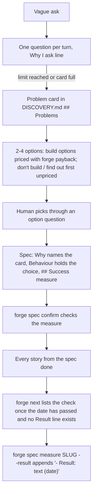

# The agent works as an FDE

## What and why

Most people running Forge are forward deployed engineers with no product manager behind them, and
their customers often don't know what to build. This task teaches the agent to act as their product
partner, and makes the result checkable after ship:

- The Forge skill gains a short FDE section (at most 70 lines). It covers how to ask (one question
  per turn, about what already happened, with a one-line "Why I ask" until the FDE says they know
  why), how deep to go (a Lite fix asks at most two questions, a story at most eight), problem cards,
  options, and the check-back. Worked examples, the question bank, a customer call script and
  bad-to-better questions go into a separate reference file the agent opens only when it needs them.
- New projects get a `## Problems` section in their discovery notes, with one card per pain. An
  existing project's discovery notes get it the first time the agent runs discovery there.
- `forge payback` prices each build option: it turns rough numbers into a payback time and one of
  build, smallest slice first, don't build, or find out first. The "don't build" and "find out
  first" options are listed without a price. The agent never does this arithmetic by hand.
- A spec confirmed from now on must say how success will be measured: metric, baseline, target and
  check date.
- Nothing is stored ahead of time for the check-back. Once every roadmap story from such a spec is
  done and its check date has passed, `forge next` lists the check until
  `forge spec measure <slug> --result` writes the measured result into the spec.
- Discovery is owned by the Forge skill in `harness.yaml`, and impeccable may be used for
  prototypes. Removing gstack itself is the next task.

## Workflow

This task starts at the skill text and ends at the recorded result. It does not change doctor,
pr-link, outcomes, the gstack command or any gstack text.

## Manual Verification

1. Open the Forge skill: the new "Work as the forward deployed engineer" section is at most 70
   lines and covers asking rules, depth limits, problem cards, options, `forge payback`, the success
   measure and the check-back. The discovery row of the "next says" table points to it, and new
   intent rows cover a vague ask, "is this worth building" and "did it pay off". The reference file
   holds two worked examples, the question bank, the call script and the bad-to-better table.
2. Read the section's rules. It says:
   - ask one question per turn, about what already happened;
   - propose no solution during discovery;
   - add a "Why I ask" line to each question until the FDE says they know why;
   - a Lite fix gets at most two questions and a story at most eight, with unanswered fields
     written "unknown" and priced as guessed;
   - fact questions offer neutral choices with no recommendation, while decision questions put the
     recommendation first;
   - options include "don't build" and the smallest slice, and only build options are priced with
     `forge payback`.
3. Run `./forge init` into a throwaway folder: its `docs/product/DISCOVERY.md` has `## Problems`
   with one example `###` card listing job, workaround, cost, who feels it, how often and evidence.
   The skill tells the agent to add that section to an existing DISCOVERY.md the first time it runs
   discovery there. `harness.yaml` names the Forge skill as discovery owner and allows impeccable in
   prototype. Its gstack lines are unchanged.
4. `./forge payback --build-days 3 --day-rate 1000 --revenue-per-month 1000 --confidence measured`
   prints 3.0 months and "build". With `--build-days 1` and `--day-rate` 3001 it prints "smallest
   slice first", with 12000 still "smallest slice first", and with 12001 "don't build". The same
   command with no value input prints "find out first". Running any of these twice prints the same
   line, and a negative number, a chance above 1, or a half-given value group (hours without people)
   is refused with the missing or bad flag named.
5. Save and grill a draft spec with no `## Success measure`: `forge spec confirm` refuses and names
   the section. With an empty Target, or a check date of `2026-13-01` or `next month`, it refuses and
   names that field. With all four fields filled it confirms, and the file differs only in its
   status line. A spec that was already confirmed without a measure still reports "already
   confirmed", and `forge spec save` of an incomplete draft names the missing success measure in its
   one-line hint.
6. Use a confirmed spec with a success measure whose check date is in the past, and two roadmap
   stories linked to it.
   - With one story pending, `forge next` does not list it. With both done, it lists the check and
     names `forge spec measure <slug>`. Adding a third pending story linked to the spec stops the
     listing again, and marking that story done brings it back.
   - With a future check date, nothing is listed.
   - `forge spec measure <slug> --result "credits down 40%"` appends `- Result: credits down 40%
     (<today>)` to the Success measure section, changes nothing else in the file, and stops the
     listing.
   - The command refuses an unknown slug, a spec with no Success measure, and an empty result.
   - `plans/deferrals.md` is unchanged throughout.

## Risks

- The skill is read every session. The FDE section is held to 70 lines by a test, and examples stay
  in the reference file.
- Good discovery depends on the agent following the skill, and no automated test can prove live
  questioning. A scripted walkthrough in a throwaway client stays a story-level check before merge
  (see Technical notes). Inside this task, a static test pins the rules the walkthrough relies on.
- Cost figures end up in client repositories. The skill says rounded rates only, never real
  salaries.
- Recording a result edits a confirmed spec. The only grill that watches `docs/specs/` is the
  one-time sign-off grill, so this is safe after ship.

---

## Technical notes

- Skill (`factory/skills/forge.md`): insert `## Work as the forward deployed engineer` after the
  route section (forge.md:76-118, before :120). Replace the `discovery/prototype` row (forge.md:133,
  today gstack `/office-hours`) with a pointer to that section. Add three intent rows after
  forge.md:159: vague ask, "is this worth building" (`./forge payback`), "did it pay off"
  (`./forge next`, then `./forge spec measure <slug> --result`). Leave forge.md:149 and :153 (direnv
  and gstack migrate) for the GSTACK task. The section is built from the reviewed draft and must
  match the confirmed spec, not the draft:
  - Depth: Lite fix ≤2 questions; everything else is a story, ≤8 questions. At the limit, unanswered
    fields are written "unknown" and priced as guessed. Drop the draft's "small story" lane.
  - Asking: fact questions get neutral options plus "I don't know" with no recommendation; decision
    questions put the recommendation first. Show "Why I ask" until the FDE says they know why (only
    that opt-out).
  - Cards: six fields (job, workaround, cost, who feels it, how often, evidence; drop "Decider") in
    DISCOVERY.md under `## Problems`, adding the section to an existing file on first discovery use.
    The chosen card's heading is named in BRIEF.md `## Summary` (the Brief has no Problem heading)
    and in the spec's `## Why`. For customer notes in `docs/context/`, write what they show into the
    cards, then `./forge context mark <note> --harvested --outputs docs/product/DISCOVERY.md` (real
    flags, forge.py:528-536).
  - Options: 2-4 options, always including don't build and the smallest testable slice. Only build
    options are priced with `./forge payback`; "don't build" and "find out first" are listed without
    it. The choice and one line of why go into the spec's Behaviour. UI prototypes use impeccable
    when installed, else plain HTML under `prototype/`.
  - Success measure: `- Metric:`, `- Baseline:`, `- Target:`, `- Check date: YYYY-MM-DD`.
    Check-back is `forge next`, then `forge spec measure`, replacing the draft's
    `defer add`/`defer resolve` flow. Success checks are never deferrals.
- Reference (`factory/skills/fde-reference.md`, new): the draft trimmed to two worked examples
  (dashboard, don't build), question bank, call script and bad-to-better table. Update it to the
  same rules: six-field card in DISCOVERY.md, `forge payback` on build options only, "Check date",
  and a `forge spec measure` check-back. Upgrade ships it because harness-owned `factory/skills/`
  children are replaced by name (upgrade.py:4654-4660).
- DISCOVERY template (scaffold.py:174-190, shared by init at scaffold.py:637-638 and adopt at
  adopt.py:351, which only creates a missing file): replace `## Problem` with `## Problems`, a
  one-line comment and one `###` example card with the six field labels. It goes through
  `.format(name=…)`, so no literal braces. An adopted DISCOVERY.md that already exists is not
  rewritten; the skill adds the section on first use.
- `harness.yaml`: `phases.discovery.owner` (harness.yaml:39) becomes `"forge-skill"`. Add
  `"impeccable"` to `phases.prototype.allowed` (harness.yaml:48-52). The precedence tier
  (harness.yaml:21) and the disabled list (harness.yaml:212-213) stay for GSTACK. No code parses
  these keys: `skill_groups` reads only implementation and review (delegate.py:911-934).
- `forge payback` (new `forge_cli/payback.py`, wired in forge.py beside the other modules at
  :86-105):
  - Parts: a pure `payback(...) -> (months | None, verdict)`, verdict and confidence constants, a
    `PaybackInputError(ValueError)`, and a thin `cmd_payback` that prints one line.
  - Inputs: `--build-days`, `--day-rate` (both required); value groups `--hours-per-month` +
    `--people` + `--hourly-rate`, `--revenue-per-month`, `--incident-cost` + `--incident-chance`
    (0..1, per month); and `--confidence measured|estimated|guessed|unknown`, default unknown.
    Weights are 1, 0.5, 0.2 and 0.2.
  - Arithmetic: exact `fractions.Fraction` from decimal strings, so 3 and 12 compare exactly.
    Round only for display. The value groups given are summed.
  - Verdicts: no value group → "find out first"; confident value 0 → "don't build"; ≤3 → "build";
    >3 and ≤12 → "smallest slice first"; >12 → "don't build".
  - Refusals: negative, non-numeric or non-finite input, and partial groups, each naming the flag.
- Success measure (specs.py):
  - Add `success_measure(text)`: a field map from `parse_sections(...)["Success measure"]`, lines
    `- <Field>: value`, case-insensitive, including an optional `Result`.
  - Add `success_measure_problems(text)`. Problems are a missing section, an empty Metric,
    Baseline, Target or Check date, or a check date that is not `\d{4}-\d{2}-\d{2}` and
    `date.fromisoformat`-valid.
  - `cmd_confirm` appends the problems to `missing` (specs.py:162-164, before the grill).
    `cmd_save` adds them to its one-line hint (specs.py:140-145).
  - Leave `missing_required_content` and `REQUIRED_SECTIONS` alone: test_gates.py:2828-2868 pins
    them.
  - "Confirmed after this change": the check runs only on the draft → confirmed transition, which
    is the only way `spec confirm` confirms. An already-confirmed spec returns before any check
    (specs.py:156-158), and no other command reads spec content (roadmap and plan use status only,
    via `resolve_spec_reference`, specs.py:96-113). So there is no version field or date cutoff to
    maintain, and a draft saved earlier but confirmed later needs the measure, as the spec says.
  - `forge spec save` description and `--from` help (forge.py:395-406) name `## Success measure`.
    `docs/specs/README.md` gains a short paragraph with the four-line shape and the
    `forge spec measure` result line. `griller.md` spec gate bullet (griller.md:13-14) gains one
    line: flag a missing or incomplete success measure.
- `forge spec measure <slug> --result "<text>"` (new `cmd_measure` in specs.py, subparser beside
  confirm at forge.py:410-413):
  - Refuse a slug that is not a safe slug or has no `docs/specs/<slug>.md` (`SAFE_SLUG`,
    specs.py:17), a spec with any success-measure problem ("no Success measure"), and a result that
    is empty after whitespace is collapsed.
  - Find the section's span with `SECTION_HEADING` and `outside_examples` (factory_lib.py:276, :419;
    the same rule `parse_sections` uses). Insert `- Result: <text> (<date.today()>)` after its last
    non-blank line, and change nothing else.
  - One-line output; append a `spec-measured` event like confirm does (specs.py:185).
- `forge next` (phase.py, after the spec-debt step at :817-825; `cmd_next` has no early return):
  - For each confirmed spec from `spec_records` (specs.py:65-76) with no success-measure problems,
    no `Result`, and a check date ≤ `date.today().isoformat()`, whose linked roadmap items (items
    whose `spec` equals its path) are at least one and all `status == "done"`, add one step:
    `[dev] Success check due since <date> for docs/specs/<slug>.md: measure it, then ./forge spec
    measure <slug> --result "<measured result>"`.
  - A spec with no linked story is not listed. Nothing is written.
  - `forge pr-link`, outcome files, the PR-link workflow and the deferral ledger
    (`plans/deferrals.md`, deferrals.py:36) are untouched.
- Existing tests whose spec fixtures need a complete success measure:
  - test_gates.py::test_spec_confirm_roadmap_derive_and_signoff_gate (:2884)
  - test_gates.py::test_adhoc_capture_is_visible_debt_not_a_build_bypass (:13023)
  - test_regrill_scope.py::test_spec_confirmation_does_not_use_another_specs_pass (:1327)

  The completeness check runs before the grill check there.
  test_gates.py::test_spec_confirm_refuses_a_spec_missing_required_headings (:2794) stays green: it
  asserts substrings, and the added problems never contain "grill".
- New tests: `factory/tests/test_fde.py`, which imports `HARNESS, repo, run, record_grill` from
  test_gates. The next-listing tests write `plans/roadmap.json` items and spec files directly, using
  past (2000-01-01) and future (2999-12-31) check dates.
- Story-level check before merge (not a task criterion): in a throwaway client made by
  `./forge init`, run the scripted vague ask ("The customer wants a dashboard for their ops team",
  answers "6 dispatchers", the late-truck story, "daily, about 5 times", "I know why you ask", "about
  20 minutes each plus about $2k a month in credits", then "I don't know"). Confirm:
  - one question per turn;
  - "Why I ask" lines only before the opt-out;
  - neutral fact options;
  - a stop by the eighth question;
  - a filled card with "unknown" fields;
  - build options priced;
  - the card named in the BRIEF Summary and the spec's Why;
  - a Lite typo fix asks at most two questions.
- Boundedness: about 210 lines of code, 270 of docs and 340 of tests across 13 files, which fits
  one session.
