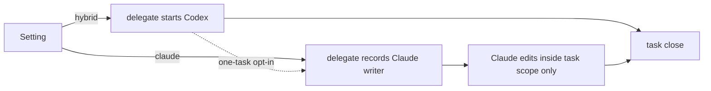

# Executor modes

## What and why

Today only Codex may change product code when Claude coordinates, so a Claude-only team cannot ship.
One setting now picks who writes: hybrid (default: Codex writes), codex (only Codex), or claude
(Claude and its subagents; no Codex needed). `forge delegate` in claude mode records a writer entry
instead of starting Codex. Claude may then edit inside the task's scope, and task close accepts that
entry as the write proof. Hybrid opts in per task by running delegate once with the setting on
claude. Proof, review and close gates are identical. Codex-coordinated sessions are unchanged.

## Workflow

## Manual Verification

1. No setting: Claude's in-scope edit is refused and points to `forge delegate`; doctor shows hybrid.
2. Run delegate once with the setting on claude: no Codex starts; in-scope edit passes, outside is refused.
3. Claude mode, no Codex installed: doctor passes, grill offers a fresh Claude reader, task close reviews with the claude engine and closes.
4. Codex mode: Claude's edits stay refused and close still asks for a Codex launch.
5. Codex-coordinated session with the setting on claude: delegate and doctor refuse and name it.
6. A misspelled value is refused and the message lists the three valid values.

## Risks

- The writer entry allows writing but does not prove it happened. The diff, proof and review still decide, as for native Codex today.
- A shared `.envrc` that sets this blocks teammates who coordinate from Codex. That is deliberate, and the template never sets it.
- In claude mode a Lite window works the same way: `forge fix` records a Claude writer entry instead of
  starting Codex, and Claude edits stay inside the window's file budget.

---

## Technical notes

- Resolver in `forge_cli/codex_runtime.py`, next to `selected_coordinator`:
  `selected_executor()` reads `FORGE_EXECUTOR` (strip/lower). When `coordinator_runtime() == "codex"`
  it returns `"codex"` for unset or `codex` and raises `SystemExit` for any other value ("Codex
  coordination always executes natively; unset FORGE_EXECUTOR"). Otherwise it returns `hybrid` when
  unset and `SystemExit`s on anything outside `hybrid|codex|claude`. Add
  `review_engine() -> "claude" if selected_executor() == "claude" else "codex"`.
- Write hook, `pre_tool_use.py`, Claude branch (~1461-1488): after `live_worker_admission`, when
  there are `scoped_targets`, no worker credential, `window is None` and `selected_executor() !=
  "codex"`, admit through the existing `native_stage_admission(root)` (exactly one active stage plus
  the latest host-native preparation bound to stage, brief, contract digest and effective scope).
  Before that, run the same `has_opaque_product_write` check as `guard_product_writes`. Then use
  `path_in_scope` against `worker["scope"]`. Deny with the admission error plus the hint
  "`FORGE_EXECUTOR=claude ./forge delegate <task-id>`". A `SystemExit` from the resolver becomes a
  `deny`. Every other path, including open windows and codex mode, keeps `guard_product_writes`. The
  native Codex branch is untouched. The hook writes nothing.
- Delegate, `launch_companion` (`delegate.py` ~1944-2100): call `executor = selected_executor()`
  first, so Codex sessions refuse there. Set `host = runtime == "codex" or executor == "claude"`
  (Lite included, exactly as native Codex Lite prepares today; the hook then admits Claude writes in an
  open Lite window through the existing native Lite admission and the window's budget). Use `host` in place of `runtime == "codex"` for the lock and reconcile conditions
  and the host-native branch. Keep `codex_hook_readiness` on `runtime == "codex"` only. The
  preparation row is the existing `transport: host-native`, `launch_status: prepared` record (the
  "writer list"), with no schema change. `cmd_delegate`'s event name follows the returned descriptor.
  Grill (`grill.py`) goes through `launch_companion`, so claude mode prepares a fresh host reader with
  no change there. `record_grill_from_json.py --cold-result --preparation-id` already records it.
- Close: in `_require_successful_launch` (`stages.py` ~1831), after the Codex-coordinator block,
  return `""` when `selected_executor() != "codex"` and `_host_native_preparation_valid(...)`. The
  companion and degraded-window path is unchanged, and the "no successful write launch" wording is
  kept. This one function covers close preflight (`close.py:146`) and stage finish (`stages.py`
  4362/4372/4395). `validated_measurement_launch` already falls back to host-native preparation.
- Review: in `forge.py` both `--engine` parsers default to `None`. `close.py:188` and
  `review.py` (`cmd_review` 1959/1988) pass `getattr(args, "engine", None)`. `review_task` and
  `review_lite` begin with `engine = engine or review_engine()`.
- Doctor, `cmd_doctor`: add an `executor` row with the resolved mode, red with the resolver message
  on refusal. When the mode is `claude`, set `required=False` on rows whose name starts with
  `codex` before counting failures.
- Docs: `.claude/CLAUDE.md` role split and grill line (stay at or under 40 lines), the WORKFLOW.md
  delegate paragraph, and the delegation-boundary closeout bullet each name the three modes and the
  hybrid one-command opt-in.
- Tests: one new `factory/tests/test_executor_modes.py` that reuses the helpers in
  `test_worker_admission.py`, `test_gates.py`, `test_grill_release.py` and
  `test_review_lenses_in_parallel.py`.

<!-- forge:contract -->
## Contract (recorded)

Rendered by the harness from the recorded decomposition; edit the decomposition, not this block. It is excluded from the plan's approval and grill digests, so a re-render never stales either.

**Objective.** FORGE_EXECUTOR hybrid/codex/claude for Claude-coordinated sessions; Claude writers admitted under the same task, scope and proof gates; the writer record is the stage's write proof.

**Acceptance criteria**

- FORGE_EXECUTOR selects hybrid (default), codex or claude, and each passes the same task gates
- Codex-coordinated sessions keep native execution and refuse other executor settings

**Write scope** (what `stage done` measures the diff against)

- factory/scripts/forge_cli/codex_runtime.py
- factory/scripts/pre_tool_use.py
- factory/scripts/forge_cli/delegate.py
- factory/scripts/forge_cli/stages.py
- factory/scripts/forge_cli/review.py
- factory/scripts/forge_cli/close.py
- factory/scripts/forge_cli/doctor.py
- factory/scripts/forge.py
- factory/tests/test_executor_modes.py
- .claude/CLAUDE.md
- WORKFLOW.md
- docs/specs/delegation-boundary.md

**Required tests** (run by `stage done`)

- `test_executor_resolver_defaults_to_hybrid_and_refuses_unknown_values` -- `UV_CACHE_DIR=/tmp/forge-lean-uv-cache UV_TOOL_DIR=/tmp/forge-lean-uv-tools uv run --python 3.11 --with pytest --with psutil python -m pytest {path}::{id} -o junit_family=legacy --junitxml={report}` (factory/tests/test_executor_modes.py)
- `test_codex_coordinated_session_refuses_any_executor_but_codex` -- `UV_CACHE_DIR=/tmp/forge-lean-uv-cache UV_TOOL_DIR=/tmp/forge-lean-uv-tools uv run --python 3.11 --with pytest --with psutil python -m pytest {path}::{id} -o junit_family=legacy --junitxml={report}` (factory/tests/test_executor_modes.py)
- `test_hybrid_claude_session_stays_locked_without_a_claude_writer_record` -- `UV_CACHE_DIR=/tmp/forge-lean-uv-cache UV_TOOL_DIR=/tmp/forge-lean-uv-tools uv run --python 3.11 --with pytest --with psutil python -m pytest {path}::{id} -o junit_family=legacy --junitxml={report}` (factory/tests/test_executor_modes.py)
- `test_claude_writer_record_admits_only_in_scope_writes_in_hybrid_and_claude` -- `UV_CACHE_DIR=/tmp/forge-lean-uv-cache UV_TOOL_DIR=/tmp/forge-lean-uv-tools uv run --python 3.11 --with pytest --with psutil python -m pytest {path}::{id} -o junit_family=legacy --junitxml={report}` (factory/tests/test_executor_modes.py)
- `test_codex_executor_keeps_claude_session_locked_despite_writer_record` -- `UV_CACHE_DIR=/tmp/forge-lean-uv-cache UV_TOOL_DIR=/tmp/forge-lean-uv-tools uv run --python 3.11 --with pytest --with psutil python -m pytest {path}::{id} -o junit_family=legacy --junitxml={report}` (factory/tests/test_executor_modes.py)
- `test_claude_executor_delegate_records_writer_without_starting_codex` -- `UV_CACHE_DIR=/tmp/forge-lean-uv-cache UV_TOOL_DIR=/tmp/forge-lean-uv-tools uv run --python 3.11 --with pytest --with psutil python -m pytest {path}::{id} -o junit_family=legacy --junitxml={report}` (factory/tests/test_executor_modes.py)
- `test_claude_writer_record_is_stage_write_proof_except_in_codex_mode` -- `UV_CACHE_DIR=/tmp/forge-lean-uv-cache UV_TOOL_DIR=/tmp/forge-lean-uv-tools uv run --python 3.11 --with pytest --with psutil python -m pytest {path}::{id} -o junit_family=legacy --junitxml={report}` (factory/tests/test_executor_modes.py)
- `test_claude_executor_stage_done_closes_on_claude_writer_record` -- `UV_CACHE_DIR=/tmp/forge-lean-uv-cache UV_TOOL_DIR=/tmp/forge-lean-uv-tools uv run --python 3.11 --with pytest --with psutil python -m pytest {path}::{id} -o junit_family=legacy --junitxml={report}` (factory/tests/test_executor_modes.py)
- `test_claude_executor_grill_prepares_a_fresh_host_reader` -- `UV_CACHE_DIR=/tmp/forge-lean-uv-cache UV_TOOL_DIR=/tmp/forge-lean-uv-tools uv run --python 3.11 --with pytest --with psutil python -m pytest {path}::{id} -o junit_family=legacy --junitxml={report}` (factory/tests/test_executor_modes.py)
- `test_claude_executor_defaults_review_engine_to_claude` -- `UV_CACHE_DIR=/tmp/forge-lean-uv-cache UV_TOOL_DIR=/tmp/forge-lean-uv-tools uv run --python 3.11 --with pytest --with psutil python -m pytest {path}::{id} -o junit_family=legacy --junitxml={report}` (factory/tests/test_executor_modes.py)
- `test_doctor_claude_executor_does_not_require_codex` -- `UV_CACHE_DIR=/tmp/forge-lean-uv-cache UV_TOOL_DIR=/tmp/forge-lean-uv-tools uv run --python 3.11 --with pytest --with psutil python -m pytest {path}::{id} -o junit_family=legacy --junitxml={report}` (factory/tests/test_executor_modes.py)
- `test_claude_executor_lite_fix_records_writer_and_admits_within_budget` -- `UV_CACHE_DIR=/tmp/forge-lean-uv-cache UV_TOOL_DIR=/tmp/forge-lean-uv-tools uv run --python 3.11 --with pytest --with psutil python -m pytest {path}::{id} -o junit_family=legacy --junitxml={report}` (factory/tests/test_executor_modes.py)

**Verify commands**

- `UV_CACHE_DIR=/tmp/forge-lean-uv-cache UV_TOOL_DIR=/tmp/forge-lean-uv-tools uv run --python 3.11 --with pytest --with pytest-xdist --with psutil python factory/scripts/verify.py`
- `python3 factory/scripts/check_dual_runtime.py`
- `python3 factory/scripts/check_encoding_hygiene.py`
- `git diff --check`

**Review budget.** 12 files / 700 lines -- Eight small source edits (about 120 lines) that reuse host-native preparation and admission, three short doc amendments, and one new test file of about 400 lines.
<!-- /forge:contract -->
