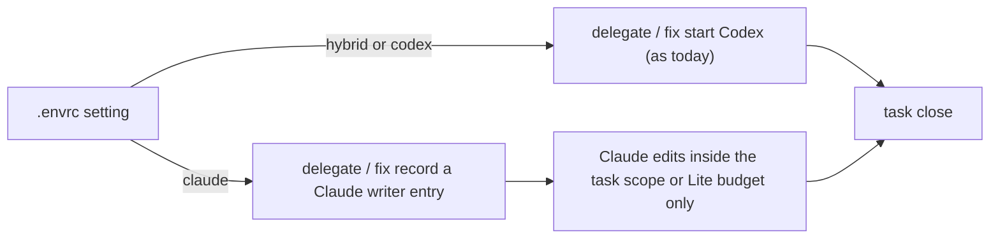

# Executor modes

## What and why

Today only Codex may change product code when Claude coordinates, so a team that uses only Claude
cannot ship. One setting in `.envrc` now decides who writes, for the whole repository:

- hybrid (default) and codex: exactly today's behaviour — Codex workers write.
- claude: Claude and its subagents write; no Codex is needed anywhere.

The same task scope, proof, review and close checks apply in every mode. Codex-coordinated sessions
keep native Codex execution. Letting Claude write a single task while in hybrid is left for later.

## Workflow

## Manual Verification

1. No setting: a Claude edit to product code is refused and `forge delegate` starts Codex, as today.
2. `FORGE_EXECUTOR=codex`: same as step 1.
3. `FORGE_EXECUTOR=claude`, active task: `forge delegate` records a Claude writer and starts no Codex;
   an in-scope edit passes, an out-of-scope edit or a protected marker edit is refused.
4. `FORGE_EXECUTOR=claude`, Lite window: `forge fix` records a Claude writer; edits pass only within
   the window's file budget.
5. `FORGE_EXECUTOR=claude` on a machine without Codex: `forge doctor` (fast, full, --fix) passes without
   installing Codex; the task grill asks for a fresh Claude subagent reader; task close accepts the
   Claude writer entry and reviews with the claude engine.
6. A Codex-coordinated session with the setting on claude is refused and told to unset it; a misspelled
   value is refused everywhere with the three valid values listed.

## Risks

- A shared `.envrc` that sets claude blocks teammates who coordinate from Codex; the template never
  sets it.
- The Claude writer entry allows writing but does not prove it happened; the diff, proof and review
  still decide, as for native Codex today.

---

## Technical notes

- `codex_runtime.selected_executor()`: reads `FORGE_EXECUTOR`; Claude-coordinated → hybrid when unset,
  else hybrid|codex|claude; Codex-coordinated → only unset/codex. Every refusal lists the three values.
  `review_engine()` → claude in claude mode, else codex.
- claude mode reuses the host-native preparation row (as native Codex does), recorded with
  `executor: "claude"`: `launch_companion` (delegate and fix) prepares it instead of launching Codex.
- Write hook, Claude branch: in claude mode admit a write when the current preparation for the active
  task (or the open Lite window) has `executor: "claude"` and the path passes the same scope, Lite
  budget and protected-marker checks the native path uses. hybrid/codex: unchanged
  (`guard_product_writes`). Codex branch: resolve the executor first.
- Close (`_require_successful_launch`) and `validated_measurement_launch`: in claude mode accept a
  `executor: "claude"` preparation as the write proof; otherwise unchanged. Review defaults to
  `review_engine()`.
- Grill: in claude mode the host-native handoff tells the session to use a fresh Claude subagent as
  the cold reader (instead of `spawn_agent`), recorded through `--cold-result --preparation-id`.
- Doctor: `--fast`, full and `--fix` resolve the executor first; claude mode skips Codex CLI/plugin
  checks and installs.
- Mode switch: the write proof must match the CURRENT mode — claude mode accepts only a preparation
  recorded with `executor: "claude"`; hybrid/codex accept only a companion launch. A task begun under
  another mode is delegated again after a switch, and `delegate` refuses to prepare a Claude writer
  while a companion launch for that task is starting or running (the existing delegation lock).
  `test_claude_executor_close_accepts_claude_writer_and_reviews_with_claude` also switches modes with
  the old row present and checks both the hook and close refuse it.
- Frontier: `task_frontier_state` treats a current Claude writer preparation as "edit, then close" (not
  inspect-delegate), so `forge next` points to the right step.
- Lite in claude mode: `forge review --lite` defaults to `review_engine()` (claude), so a Claude-only
  Lite window reviews and closes without Codex.
- Protected markers (including the repo-kind marker) are always refused on the Claude path; it does not
  inherit the native path's marker exemption.
- Claude cold reader (every gate: plan, spec, signoff, epics, task): grill prepares its usual host-native
  `agent_type: griller` row; in claude mode the handoff reads "start a NEW Claude subagent (general-purpose;
  a subagent starts with no conversation history) whose prompt is only the prepared brief file; save its
  JSON reply; then record with `record_grill_from_json.py --gate <gate> [--task <id>] --input
  <disposition json> --cold-result <reply file> --preparation-id <id>`" instead of the `spawn_agent`
  descriptor.
- `forge next`: in claude mode a Claude writer preparation's next action is "edit inside the task
  scope, then `forge task close <id>`".
- The `executor` field is declared in `factory/schemas/delegation.json` (values hybrid|codex|claude)
  and validated wherever a Claude preparation is admitted.
- Hybrid Claude writes (decision 0085) are deferred by the owner's decision as D-0044; the story plan is
  amended and re-approved to match.
- User-facing docs: README.md ("Where Codex sits" and prerequisites: Codex tools are needed only for
  hybrid and codex; Claude writes in claude mode) and docs/getting-started.md (a short "Choose who
  writes code" step with the `.envrc` line).
- Other docs: AGENTS.md and `factory/skills/forge.md` (one line each, AGENTS.md stays within its size
  limit), `.claude/CLAUDE.md` (within its line limit), WORKFLOW.md, the delegation-boundary,
  strict-role-split and dual-coordinator parity specs, the parity architecture, the product brief and
  docs/FACTORY.md name the three modes.
- Tests: `factory/tests/test_executor_modes.py`.
